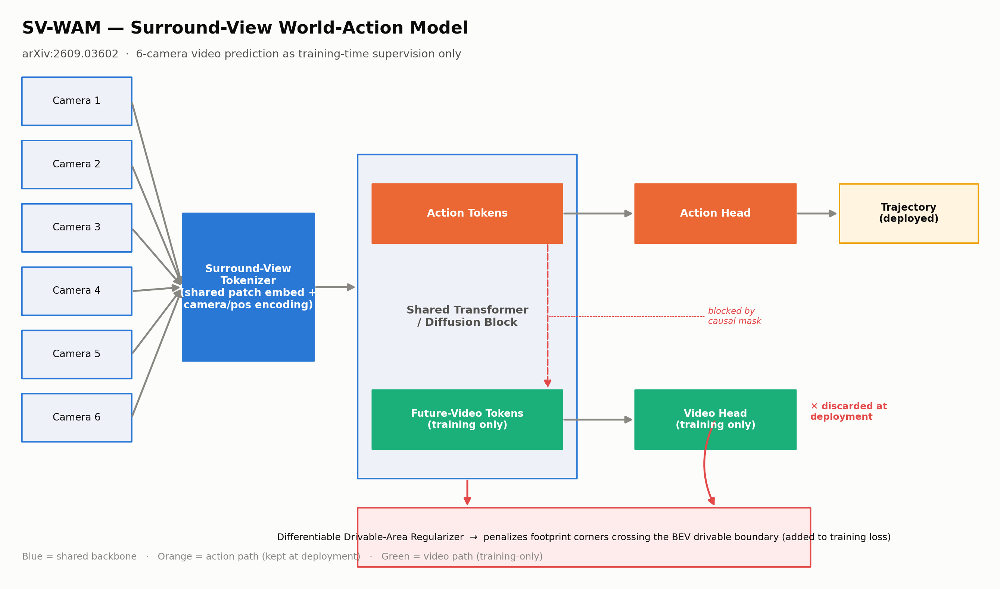
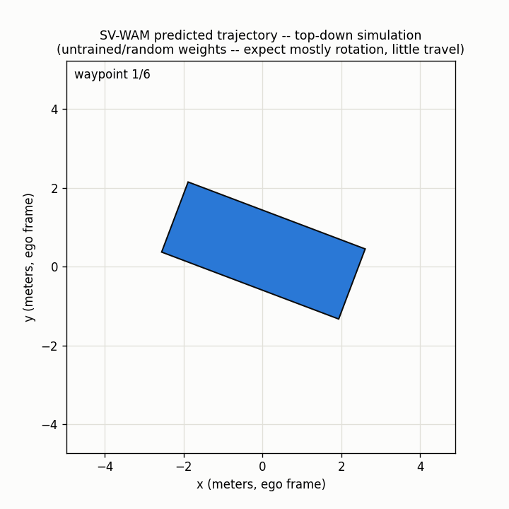

# SV-WAM — Surround-View World-Action Model (reference implementation)

Reference PyTorch implementation of the core ideas in:

> **SV-WAM: An Efficient Surround-View World-Action Model for End-to-End Autonomous Driving**
> [arXiv:2609.03602](https://arxiv.org/abs/2609.03602) — submitted September 3, 2026

Part of a daily Automotive AI paper-review series — see the [series log](../daily-series-log.md).

## Architecture



SV-WAM replaces the industry's single front-camera World-Action Model (WAM) recipe with a full 6-camera surround-view formulation, **without paying the usual inference-latency tax**:

- A shared **Surround-View Tokenizer** patch-embeds all 6 camera streams with camera-identity + spatial-position encodings.
- A shared Transformer/diffusion trunk jointly denoises **Action Tokens** and **Future-Video Tokens**.
- An **action-centered causal mask** stops action tokens from attending to the future-video tokens denoised alongside them — forcing the planner to reason about world dynamics rather than copying rendered future pixels.
- At **deployment**, the entire video branch (tokens + head) is dropped — only the action path runs, so inference cost matches a single-camera planner.
- A **differentiable drivable-area regularizer** penalizes any predicted footprint corner drifting past the drivable-area boundary, baking road-boundary safety directly into the training loss.

## Simulation



Animated top-down view of a predicted trajectory (vehicle footprint + trail). Generate your own with:
`python simulate.py --config tiny_cfg.yaml --out trajectory_simulation.gif`

## Repo layout

```
.
├── assets/                          # rendered diagrams
├── config/sv_wam_base.yaml          # model dims, loss weights, training config
├── src/
│   ├── data/                        # dataset adapter + preprocessing
│   ├── models/                      # tokenizer, transformer block, heads, top-level model
│   ├── losses/                      # drivable-area regularizer + composite loss
│   └── utils/                       # causal-mask builder, geometry helpers
├── train.py
├── evaluate.py
├── scripts/                         # thin wrapper shell scripts
└── tests/                           # pytest smoke tests (shape + backward pass)
```

## Quickstart

```bash
pip install -r requirements.txt

# Smoke-test the full pipeline against synthetic data (no dataset needed)
python train.py --steps 20

# Evaluate (ADE/FDE against synthetic ground truth, or your own data once wired up)
python evaluate.py
```

Run the tests:

```bash
pytest tests/ -v
```

## Wiring up real data

`src/data/surround_view_dataset.py` ships with a synthetic fallback so the
whole pipeline runs out of the box. To train on real clips, implement
`SurroundViewDataset._load_sample` against your own manifest format (documented
in that file's docstring) — typically NAVSIMv2 or nuScenes-derived 6-camera
clips with per-clip ground-truth trajectories.

## Limitations (from the paper's abstract / architectural analysis)

- Training cost stays high — the model still learns full 6-camera video generation before that branch is discarded at deployment.
- The causal-masking trick is a training-time discipline; its safety benefit under distribution shift (heavy rain, sensor dropout) isn't established beyond the NAVSIMv2/nuScenes benchmarks reported in the paper.
- The drivable-area regularizer needs an accurate BEV/HD-map mask at train time — map quality directly caps the safety upside.
- **Note:** exact NAVSIMv2/nuScenes numeric results were not extractable from the paper abstract (full-text fetch was rate-limited during the review that produced this repo) — see the daily-review doc for the full sourcing note. No results figure is included here for that reason; only the architecture is illustrated.

## Citation

```bibtex
@article{svwam2026,
  title   = {SV-WAM: An Efficient Surround-View World-Action Model for End-to-End Autonomous Driving},
  journal = {arXiv preprint arXiv:2609.03602},
  year    = {2026}
}
```

This is an independent, best-effort reference implementation for educational purposes — it is **not** the authors' official code release.
