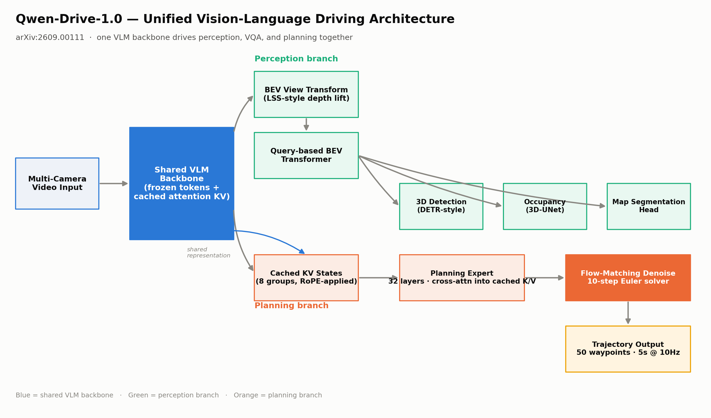
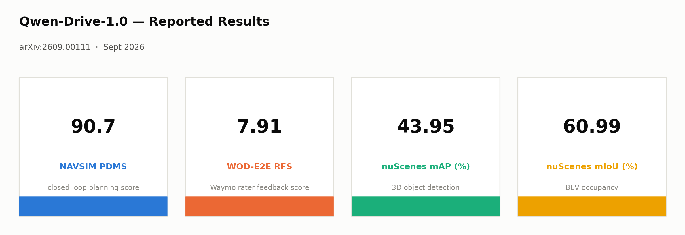
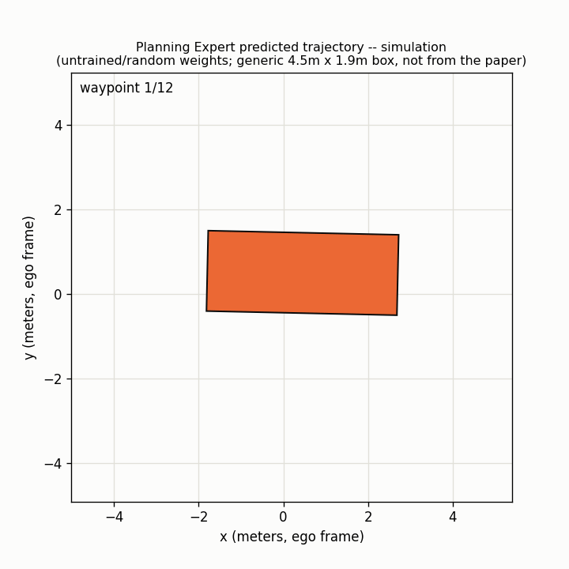

# Qwen-Drive-1.0 — Planning Expert (reference implementation)

Reference PyTorch implementation of the core novel piece in:

> **Qwen-Drive-1.0: An Initial Step towards a Vision-Language Foundation Model for Autonomous Driving**
> [arXiv:2609.00111](https://arxiv.org/abs/2609.00111) — submitted August 31, 2026 (Qwen team)

Part of a daily Automotive AI paper-review series — see the [series log](../daily-series-log.md).

## Architecture



## Reported Results



Qwen-Drive-1.0 keeps a pretrained vision-language model intact and folds 3D perception, VQA, and motion planning into one shared representation:

- An external BEV head (not implemented here) taps the VLM's shared tokens for 3D detection, occupancy, and map segmentation.
- **This repo implements the Planning Expert** — a 32-layer diffusion-transformer that cross-attends directly into **cached RoPE key/value states from 8 groups of the VLM's own attention layers**, then denoises trajectories via flow matching (x-prediction, 10-step Euler) into 50 waypoints over a 5-second horizon at 10Hz.
- The key architectural departure from a bolt-on planner: at every layer, trajectory-token queries attend over `[cached VLM K/V || trajectory K/V]` in **one joint softmax** — so planning reasons with the exact same scene representation the VLM uses for perception and VQA, instead of learning to drive from scratch behind a frozen perception stack.

## Simulation



Animated top-down view of a sampled trajectory (generic vehicle box, not from the paper — the model predicts a point path). Generate your own with:
`python simulate.py --config tiny_qwen_cfg.yaml --out trajectory_simulation.gif`

## Repo layout

```
.
├── assets/                          # rendered diagrams
├── config/planning_expert_base.yaml
├── src/
│   ├── data/                        # TrajectoryDataset (consumes pre-extracted VLM caches)
│   ├── models/
│   │   ├── vlm_kv_cache.py          # VLMKVCache container
│   │   ├── time_embed.py            # sinusoidal_time_embed
│   │   ├── ada_ln.py                # AdaLNModulation
│   │   ├── planning_expert_layer.py # joint self+cross attention layer
│   │   └── planning_expert.py       # top-level 32-layer model
│   ├── losses/flow_matching.py      # FlowMatchingObjective (x-pred + temporal reg)
│   ├── sampling/euler_sampler.py    # 10-step Euler ODE solver (inference)
│   └── utils/shapes.py              # shape-assertion helpers
├── train.py
├── inference.py
└── tests/                           # pytest smoke tests
```

## Quickstart

```bash
pip install -r requirements.txt

# Smoke-test the full pipeline against synthetic VLM caches (no VLM needed)
python train.py --steps 20

# Run the 10-step Euler sampler on one example
python inference.py
```

Run the tests:

```bash
pytest tests/ -v
```

## Wiring up a real VLM backbone

This repo implements **only the Planning Expert** — it deliberately does not
re-implement Qwen's VLM backbone. `src/data/trajectory_dataset.py` expects
*pre-extracted* cached key/value tensors (8 groups, one per attention-layer
group, RoPE already applied) plus pooled instruction/ego-state embeddings.
Run your own VLM backbone offline (or add a live extraction hook) to
produce these, following the manifest format documented in that file's
docstring. **Important:** cached K/V tensors must use the same `head_dim`
as the Planning Expert's own heads (`model_dim // n_heads`), not
`model_dim // n_kv_heads` — grouped-query attention shares `head_dim`
across query and KV heads, it only varies the head *count*.

## Limitations (from the paper's abstract / full text)

- Full VLM + 1.1B-param diffusion planner = heavy compute, far from low-power ADAS MCU/SoC budgets.
- 10-step Euler solver at inference — iterative denoising costs latency vs. single-shot regression.
- 4-stage training recipe (perception → VQA → planning → RL) is expensive to reproduce.
- Framed by the authors as "an initial step" — no edge-latency or long-tail robustness numbers reported yet.

## Citation

```bibtex
@article{qwendrive2026,
  title   = {Qwen-Drive-1.0: An Initial Step towards a Vision-Language Foundation Model for Autonomous Driving},
  journal = {arXiv preprint arXiv:2609.00111},
  year    = {2026}
}
```

This is an independent, best-effort reference implementation for educational purposes — it is **not** the authors' official code release.
