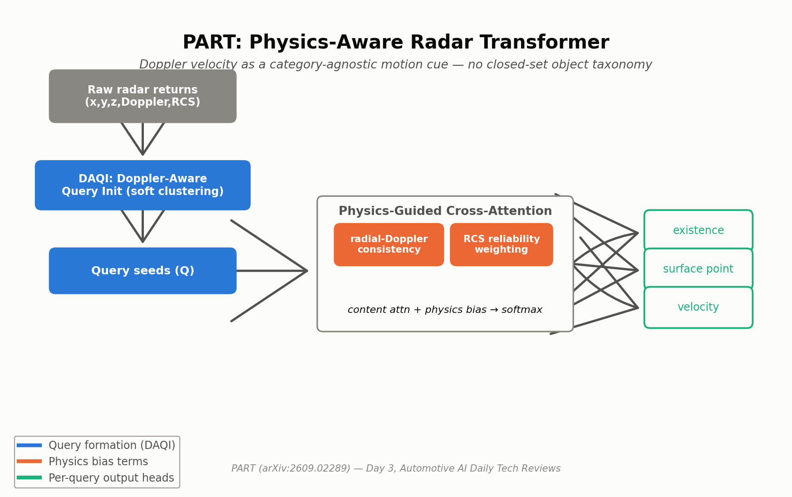
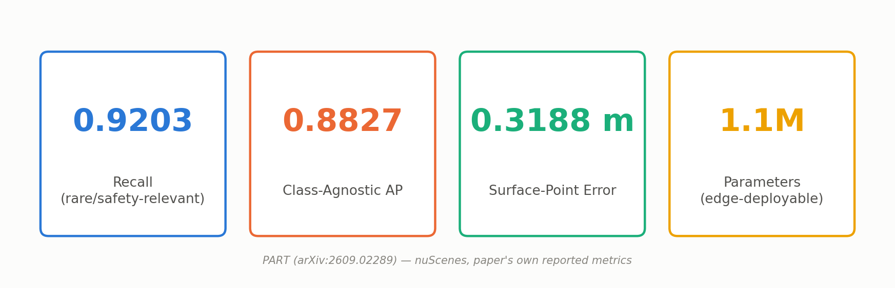
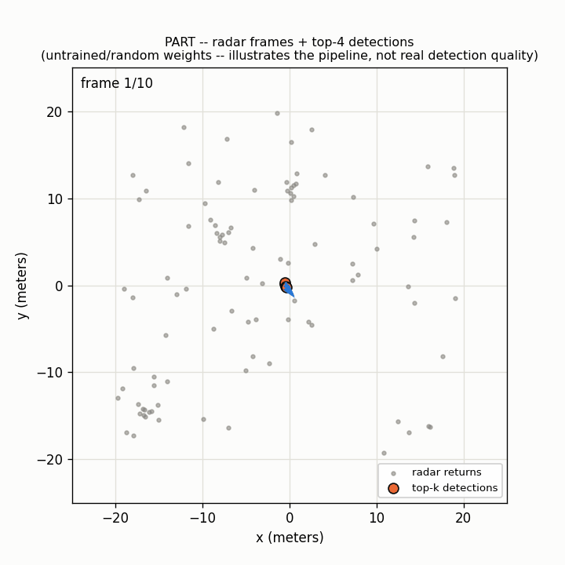

# Day 3 — PART: Physics-Aware Radar Transformer

**Paper:** If It Moves, Radar Knows: A Physics-Aware Radar Transformer for Class-Agnostic Moving-Object Detection (PART)
**arXiv:** [2609.02289](https://arxiv.org/abs/2609.02289) — submitted September 2, 2026
**Category:** ADAS radar perception — class-agnostic moving-object detection

## What is it?

PART is a radar-only detector that finds moving objects your training set never labeled — a stroller, a wheelchair, debris — by reading Doppler velocity instead of learning object categories. It skips full 3D box regression entirely and predicts existence, a surface point, and 2D velocity per object.

## Architecture



**Core innovation — Physics-Guided Cross-Attention (PGCA):** adds two physical bias terms straight into the attention logits — radial-Doppler consistency (does a point's measured Doppler match the query's hypothesized velocity projected onto that point's line of sight?) and RCS-based reliability weighting.

## Old vs. New

- **Old way (class-aware 3D box heads):** detectors trained on fixed taxonomies miss rare movers outside the label set — exactly the long-tail objects that matter most for safety.
- **New way (PART):** Doppler velocity is category-agnostic physics, not a learned class prior, so the model flags "this is moving" without ever needing to have seen "this" before.

## Reported results



## Simulation



Animated sequence of synthetic radar frames (moving point clusters + clutter) with PART's top-k detections and predicted velocity arrows overlaid each frame. Generate your own with:
`python simulate.py --config tiny_part_cfg.yaml --out trajectory_simulation.gif`

## Repository layout

```
day-03-part/
├── README.md
├── requirements.txt
├── config/part_base.yaml
├── tiny_part_cfg.yaml         # small dims for a fast simulate.py / smoke test
├── assets/{part_architecture.png, part_results.png}
├── src/models/part_model.py   # DAQI, PGCA, PARTDecoderLayer, PARTModel, UncertaintyAwareSupervision, part_loss
├── train.py                   # synthetic-data smoke-test training loop
├── simulate.py                # renders trajectory_simulation.gif
└── tests/test_part_model.py   # shape + backward-pass tests
```

## Quickstart

```bash
pip install -r requirements.txt
pytest tests/ -v          # 4/4 passed
python train.py --steps 20
python simulate.py --config tiny_part_cfg.yaml --out trajectory_simulation.gif
```

**Verified this session:** `pytest tests/ -v` — 4/4 passed (forward shapes, masked-point handling, loss + backward pass, uncertainty-aware soft-target logic). `python train.py --steps 5` — all three loss terms logged and decreasing. `python simulate.py` — renders a real 10-frame GIF end to end.

## Limitations

- No full 3D box output — good for "something's there and moving," less useful when planning needs exact object extent.
- Sparse, noisy returns still limit fine-grained localization vs. LiDAR at close range.
- Class-agnostic by design — no semantic label, so a second-stage classifier is still needed downstream.
- The original research session could only reach the paper's abstract/summary (arXiv full-text fetch was rate-limited) — full ablations and named-baseline comparison tables were not independently verified.
- The simulation above uses untrained/random weights (no checkpoint), so its detections are close to random — it illustrates the visualization pipeline, not real detection quality.

## Sourcing note

Reachable only via the arXiv abstract/summary in the original research session — the code above is an original reconstruction consistent with the module names and mechanisms the paper describes (Doppler-Aware Query Initialization, Physics-Guided Cross-Attention, Uncertainty-Aware Supervision), not a line-for-line reproduction of the authors' own code.

## Citation

```bibtex
@article{part2026,
  title   = {If It Moves, Radar Knows: A Physics-Aware Radar Transformer for Class-Agnostic Moving-Object Detection},
  journal = {arXiv preprint arXiv:2609.02289},
  year    = {2026}
}
```

This is an independent, best-effort reference implementation for educational purposes — it is **not** the authors' official code release.

Sources:
- [PART (arXiv:2609.02289)](https://arxiv.org/abs/2609.02289)
