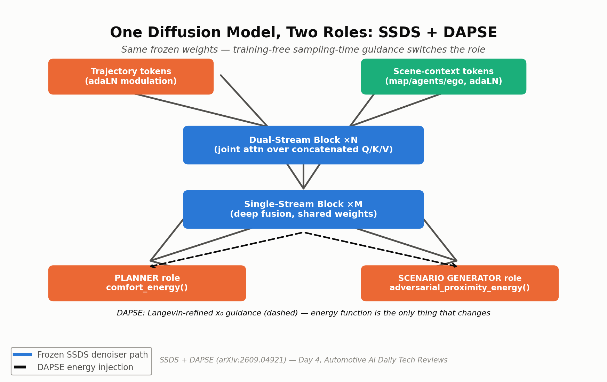
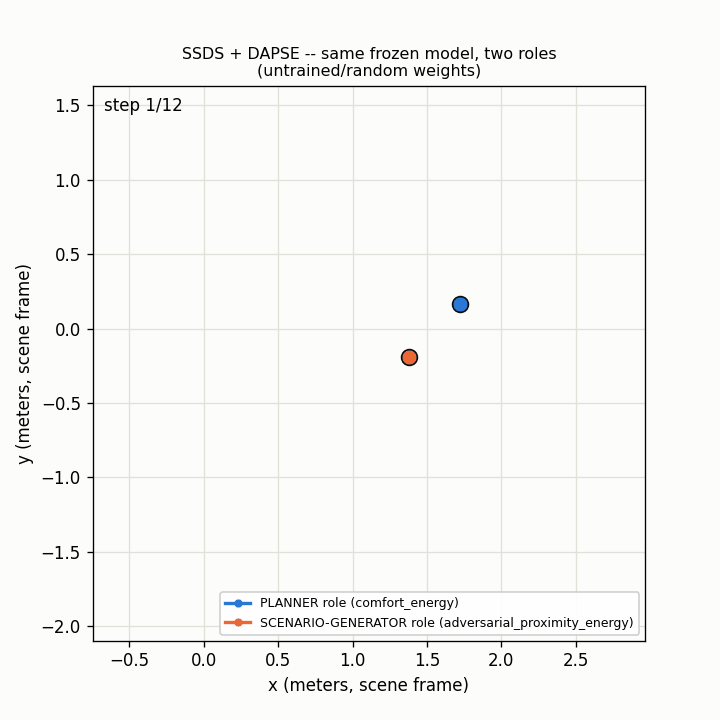

# Day 4 — One Diffusion Model, Two Roles: SSDS + DAPSE

**Paper:** One Diffusion Model, Two Roles: Guided Trajectory Planning and Safety-Critical Scenario Generation in Closed-Loop Simulation
**arXiv:** [2609.04921](https://arxiv.org/abs/2609.04921) — submitted September 4, 2026 · accepted ECCV 2026 workshop
**Category:** Multi-modal vehicle trajectory planning + safety-critical scenario generation (diffusion models)

## What is it?

One pretrained diffusion model over joint future traffic trajectories serves as both the ego motion planner AND a controllable generator of safety-critical test scenarios — switched purely at sampling time, same frozen weights.

## Architecture



**The blueprint — SSDS (Single-Stream Dual-Stream):** a diffusion-transformer decoder where trajectory and scene-context tokens get independent adaLN modulation + Q/K/V projections, then attention runs *jointly* over the concatenated tokens before a single-stream stage fuses everything deeply.

**Core innovation — DAPSE (Decoupled Annealing Posterior Sampling with Energy):** training-free guidance that refines the clean-sample (x₀) estimate every diffusion step via Langevin dynamics, injecting the gradient of *any* energy function. Flip the energy function's target and the same frozen model goes from planner to adversarial scenario generator.

## Old vs. New

- **Old way:** planning and adversarial scenario generation were two systems — a learned planner plus a hand-built generator. A new safety objective meant retraining a classifier, and guiding noisy x_t adds approximation error.
- **New way:** one frozen model, two roles. DAPSE guides at the clean x₀ level — no approximation error, no auxiliary network — so a new safety test is just a new energy function.

## Simulation



Both roles sampled from the SAME frozen denoiser via repeated `dapse_guided_step` calls: the ego's PLANNER-role trajectory (`comfort_energy`, blue) vs. another agent's SCENARIO-GENERATOR-role trajectory (`adversarial_proximity_energy`, orange), played back frame by frame. Generate your own with:
`python simulate.py --config tiny_ssds_cfg.yaml --out trajectory_simulation.gif`

## Repository layout

```
day-04-ssds-dapse/
├── README.md
├── requirements.txt
├── config/ssds_base.yaml
├── tiny_ssds_cfg.yaml         # small dims for a fast simulate.py / smoke test
├── assets/ssds_dapse_architecture.png
├── src/models/ssds_dapse.py   # DualStreamBlock, SingleStreamBlock, SSDSDenoiser, dapse_guided_step, comfort_energy, adversarial_proximity_energy
├── train.py                   # synthetic-data smoke-test training + DAPSE sampling
├── simulate.py                # renders trajectory_simulation.gif
└── tests/test_ssds_dapse.py   # shape + backward-pass + DAPSE smoke tests
```

## Quickstart

```bash
pip install -r requirements.txt
pytest tests/ -v          # 4/4 passed
python train.py --steps 20
python simulate.py --config tiny_ssds_cfg.yaml --out trajectory_simulation.gif
```

**Verified this session:** `pytest tests/ -v` — 4/4 passed (forward shape, backward pass with finite gradients, a config-mismatch error case, and both DAPSE roles). `python train.py --steps 5` — loss decreasing, both planner-role and scenario-generator-role DAPSE steps produce correctly-shaped output from the same frozen model. `python simulate.py` — renders a real 12-frame GIF end to end.

## Limitations

- Langevin inner iterations add per-step compute, in tension with the paper's own 10–20 Hz real-time budget.
- Denoising steps roughly double (10→20) for scenario-generation mode — a speed/fidelity trade-off.
- Energy functions are hand-designed — DAPSE won't discover what's safety-critical on its own.
- nuPlan-only evaluation in the paper; exact closed-loop deltas vs. named baselines were not independently verified (the original research session's fetch was truncated before the Experiments section).
- With untrained/random weights, both roles' sampled trajectories stay close together (as seen in the GIF above) — the "planner vs. adversarial" divergence the paper reports needs a trained denoiser to show up clearly.

## Sourcing note

The paper's HTML full text was fetched successfully for the SSDS architecture description and the DAPSE update rule (Eq. 6 in the paper), but the fetch was truncated before Section 6 (Experiments) — exact closed-loop nuPlan scores and named-baseline comparison tables were not retrieved. No numbers are invented; the paper's own qualitative headline finding (stronger open-loop planners showed larger degradation under DAPSE-generated scenarios) is reported without an attached score. The code above is an original reference re-implementation, not the authors' own code.

## Citation

```bibtex
@article{ssdsdapse2026,
  title   = {One Diffusion Model, Two Roles: Guided Trajectory Planning and Safety-Critical Scenario Generation in Closed-Loop Simulation},
  journal = {arXiv preprint arXiv:2609.04921},
  year    = {2026}
}
```

This is an independent, best-effort reference implementation for educational purposes — it is **not** the authors' official code release.

Sources:
- [One Diffusion Model, Two Roles (arXiv:2609.04921)](https://arxiv.org/abs/2609.04921)
