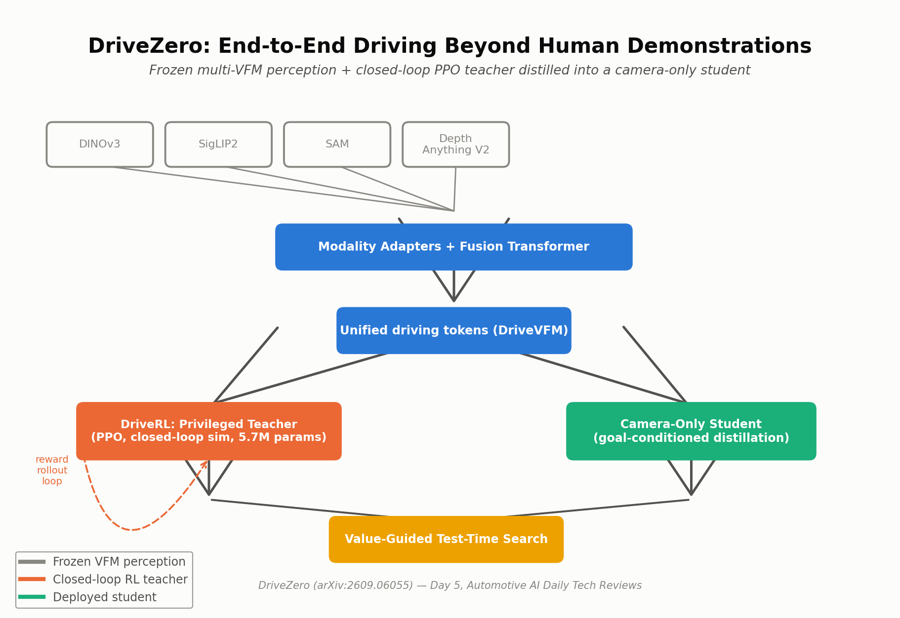
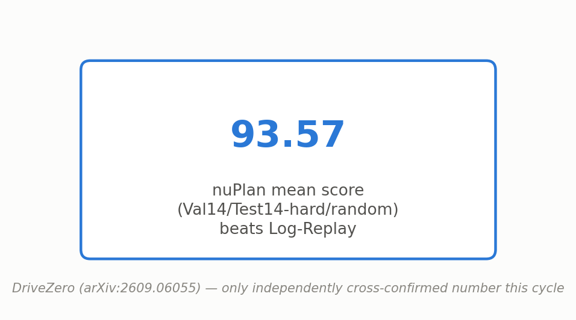
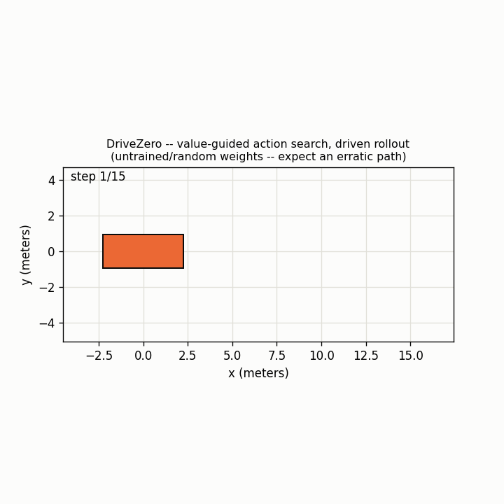

# Day 5 — DriveZero: End-to-End Driving Beyond Human Demonstrations

**Paper:** DriveZero: End-to-End Driving Beyond Human Demonstrations
**arXiv:** [2609.06055](https://arxiv.org/abs/2609.06055) — submitted September 5, 2026
**Category:** End-to-end autonomous driving / closed-loop RL (frozen multi-VFM perception fusion + PPO teacher distillation)

## What is it?

DriveZero decouples *what to see* from *what to do*: a frozen-backbone perception module feeds a driving policy trained NOT by imitating human logs, but by distilling a closed-loop RL teacher's own rollouts — letting the deployed model exceed log-replay itself.

## Architecture



- **DriveVFM** fuses frozen DINOv3 + SigLIP2 + SAM + Depth Anything V2 via per-source adapters and a cross-modal fusion transformer — zero task-specific annotation.
- **DriveRL** trains a privileged teacher with PPO inside a closed-loop, mixed-agent simulator.
- **Core innovation — goal-conditioned distillation:** the camera-only student learns from the teacher's OWN rollouts — including under augmented goals never seen in any original log — so supervision isn't capped by what a human actually drove.

## Old vs. New

- **Old way (imitation learning):** supervised purely on human logs — bounded by demonstration quality, compounding rollout error, causal confusion. Can't beat the driver it's imitating, by construction.
- **New way (teacher → distillation):** a closed-loop PPO teacher optimizes a reward, not a replay match, and can be queried under goals the logs never contained.

## Reported results



## Simulation



A driven rollout built step by step: `value_guided_action_search` samples K candidate actions from the camera-only student and picks the teacher-value-scored best one, a simple bicycle model integrates that (steering, acceleration) action into the next pose, and the loop repeats. Generate your own with:
`python simulate.py --config tiny_drivezero_cfg.yaml --out trajectory_simulation.gif`

## Repository layout

```
day-05-drivezero/
├── README.md
├── requirements.txt
├── config/drivezero_base.yaml
├── tiny_drivezero_cfg.yaml    # small dims for a fast simulate.py / smoke test
├── assets/{drivezero_architecture.png, drivezero_results.png}
├── src/models/drivezero.py   # ModalityAdapter, DriveVFM, PrivilegedTeacherPolicy,
│                              # ppo_clipped_update, CameraOnlyStudentPolicy,
│                              # distillation_loss, value_guided_action_search
├── train.py                  # synthetic-data smoke-test: PPO update + distillation update per step
├── simulate.py                # renders trajectory_simulation.gif via a driven bicycle-model rollout
└── tests/test_drivezero.py   # shape + backward-pass + PPO + distillation smoke tests
```

## Quickstart

```bash
pip install -r requirements.txt
pytest tests/ -v          # 9/9 passed
python train.py --steps 20
python simulate.py --config tiny_drivezero_cfg.yaml --out trajectory_simulation.gif
```

**Verified this session:** `pytest tests/ -v` — 9/9 passed (DriveVFM adapter fan-in shape, DriveVFM forward+backward, teacher forward/act, one PPO clipped-surrogate update, student forward+backward through `distillation_loss`, `sample_k` shape, `value_guided_action_search` shape/selection, a config-mismatch error case, and a parameter-count sanity check). `python train.py --steps 5` — one PPO teacher update + one distillation update per step, both losses print and move, then a `value_guided_action_search` shape check. `python simulate.py` — renders a real 15-frame driven-rollout GIF end to end.

## Limitations

- Teacher trains on ground-truth BEV/occupancy the camera-only car never has at deployment — a real sim-to-real gap baked into the setup.
- Simulator fidelity caps the reward signal — simulator artifacts become teacher biases.
- Four frozen foundation models is a heavy inference stack for an in-vehicle ECU without serious quantization.
- Value-guided test-time search adds inference compute (K sampled trajectories) — a latency trade-off for production ADAS budgets.
- The bicycle-model integrator in `simulate.py` is a visualization convenience, not part of the paper's own architecture — the paper's action space/dynamics model isn't specified in the abstract.

## Sourcing / reconstruction note

The paper's own full HTML/PDF text could not be fetched in the original research session (every attempt returned HTTP 429); only the abstract-level claims were used there (module names, a 5.7M-param teacher, nuPlan 93.57 mean score beating Log-Replay, qualitative SOTA claims on NAVSIMv1/v2/HUGSIM with no attached numbers). **This specific code file is a fresh reconstruction written in a later session** that did not have access to the original package's files (each scheduled run is a separate, isolated container) — it implements the documented module names and data flow (`ModalityAdapter`, `DriveVFM`, `PrivilegedTeacherPolicy`, `ppo_clipped_update`, `CameraOnlyStudentPolicy`, `distillation_loss`, `value_guided_action_search`) from scratch and is verified to run end-to-end in this session, but is not a byte-for-byte match to the earlier package and not the authors' own code. The reference config's hidden dims are deliberately small for a fast smoke test — scale `DriveVFMConfig`/`PrivilegedTeacherPolicy`/`CameraOnlyStudentPolicy` up to approach the paper's own parameter counts.

## Citation

```bibtex
@article{drivezero2026,
  title   = {DriveZero: End-to-End Driving Beyond Human Demonstrations},
  journal = {arXiv preprint arXiv:2609.06055},
  year    = {2026}
}
```

This is an independent, best-effort reference implementation for educational purposes — it is **not** the authors' official code release.

Sources:
- [DriveZero (arXiv:2609.06055)](https://arxiv.org/abs/2609.06055)
- [DriveZero Pushes Autonomous Driving Beyond Human Logs (cctest.ai technical summary)](https://cctest.ai/en/articles/drivezero-teaching-autonomous-driving-beyond-human-demonstrations)
