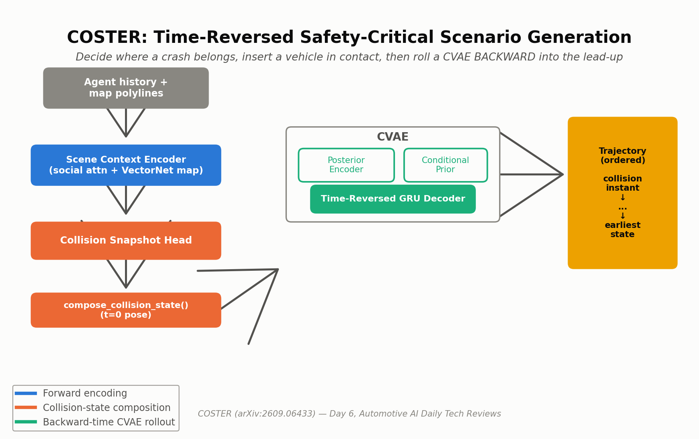
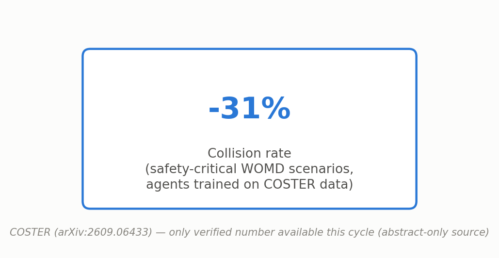
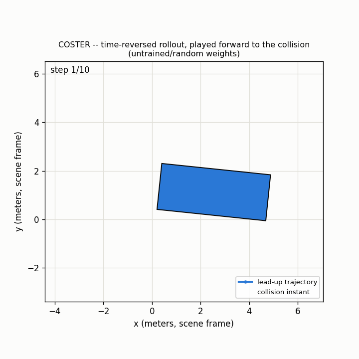

# Day 6 — COSTER: Collision Snapshot Guided Time-Reversed Scenario Generation

**Paper:** Collision Snapshot Guided Time-Reversed Safety-Critical Scenario Generation (COSTER)
**arXiv:** [2609.06433](https://arxiv.org/abs/2609.06433) — submitted September 6, 2026
**Category:** Safety-critical scenario generation — CVAE-based time-reversed trajectory rollout

## What is it?

COSTER generates safety-critical AV test scenarios by first deciding *where a crash would plausibly happen*, then using a conditional VAE to generate a trajectory **backward in time** into that crash — the reverse of what ordinary trajectory predictors do.

## Architecture



- A **Scene Context Encoder** (social attention + VectorNet-style map polylines) feeds a **Collision Snapshot Head** predicting *when* a collision is plausible along the target's future path, and *where* an inserted vehicle should make contact.
- **Core innovation — time-reversed rollout:** instead of perturbing a logged trajectory with a hand-tuned objective, COSTER inserts a new vehicle already in contact with the target, then rolls a CVAE decoder *backward*, step by step, into a plausible lead-up.

## Old vs. New

- **Old way (perturbation-based adversaries):** nudge a logged trajectory with a simplified adversarial objective — limited plausibility and diversity, bounded by the allowed deformation.
- **New way (COSTER):** learn *where a crash belongs* from traffic priors, insert a new vehicle in contact, then generate its lead-up backward — decoupling "what collision fits" from "how it's approached."

## Reported results



## Simulation



The model generates its rollout ordered [collision instant, ..., earliest state] — this script reverses it for natural forward playback, so the GIF shows a vehicle approaching, ending in the collision (vehicle turns orange, marker appears) on the final frame. Generate your own with:
`python simulate.py --config tiny_coster_cfg.yaml --out trajectory_simulation.gif`

## Repository layout

```
day-06-coster/
├── README.md
├── requirements.txt
├── config/coster_base.yaml
├── tiny_coster_cfg.yaml     # small dims for a fast simulate.py / smoke test
├── assets/{coster_architecture.png, coster_results.png}
├── src/models/coster.py     # PolylineMapEncoder, AgentHistoryEncoder, SceneContextEncoder,
│                             # CollisionSnapshotHead, compose_collision_state, PosteriorEncoder,
│                             # ConditionalPriorNet, TimeReversedRolloutDecoder, COSTERModel, coster_loss
├── train.py                 # real synthetic-data training loop + inference-mode generation pass
├── simulate.py               # renders trajectory_simulation.gif (reversed for forward playback)
└── tests/test_coster.py     # shape / composition-math / gradient-flow tests
```

## Quickstart

```bash
pip install -r requirements.txt
pytest tests/ -v          # 8/8 passed
python train.py --steps 20
python simulate.py --config tiny_coster_cfg.yaml --out trajectory_simulation.gif
```

**Verified this session:** `pytest tests/ -v` — 8/8 passed (map/agent encoder shapes, scene-context fusion, collision-state composition math, time-reversed decoder's t=0 anchor check, full-model forward in both training and inference mode, a real backward pass + optimizer step that changes parameters, and a parameter-count sanity check). `python train.py --steps 5` — all four loss terms (reconstruction, collision-time cross-entropy, contact-pose L1, β·KL) print and the total loss decreases, followed by one inference-mode generation pass sampling entirely from the learned conditional prior (no ground truth). `python simulate.py` — renders a real 10-frame GIF end to end.

## Limitations

- Collision predictions are only as good as the learned traffic prior — biased training data biases *where* COSTER thinks crashes belong.
- A learned conditional prior is harder to calibrate than a plain VAE, needing careful KL scheduling to avoid posterior collapse.
- Backward rollout assumes rough kinematic reversibility; sudden real driver reactions are time-asymmetric and harder to capture.

## Sourcing / reconstruction note

Only the arXiv abstract page was reachable in the original research session (full HTML/PDF and an ar5iv mirror were all blocked or rate-limited). The **only** quantitative claim used anywhere in this package is the abstract's own verified number: a 31% collision-rate reduction on safety-critical Waymo Open Motion Dataset scenarios for agents trained on COSTER-generated data. **This code file is a fresh reconstruction written in a later session** that did not have access to the original package's files (each scheduled run is a separate, isolated container) — only the `TimeReversedRolloutDecoder` excerpt survived in the project log verbatim; every other module (`PolylineMapEncoder`, `AgentHistoryEncoder`, `SceneContextEncoder`, `CollisionSnapshotHead`, `compose_collision_state`, `PosteriorEncoder`, `ConditionalPriorNet`, `COSTERModel`, `coster_loss`) is newly written from the documented mechanism description and verified to run end-to-end in this session, but is not a byte-for-byte match to the earlier package and not the authors' own code. Exact network widths, latent dimensionality, and the authors' own plausibility/diversity/data-efficiency numbers are not claimed.

## Citation

```bibtex
@article{coster2026,
  title   = {Collision Snapshot Guided Time-Reversed Safety-Critical Scenario Generation},
  journal = {arXiv preprint arXiv:2609.06433},
  year    = {2026}
}
```

This is an independent, best-effort reference implementation for educational purposes — it is **not** the authors' official code release.

Sources:
- [COSTER (arXiv:2609.06433)](https://arxiv.org/abs/2609.06433)
