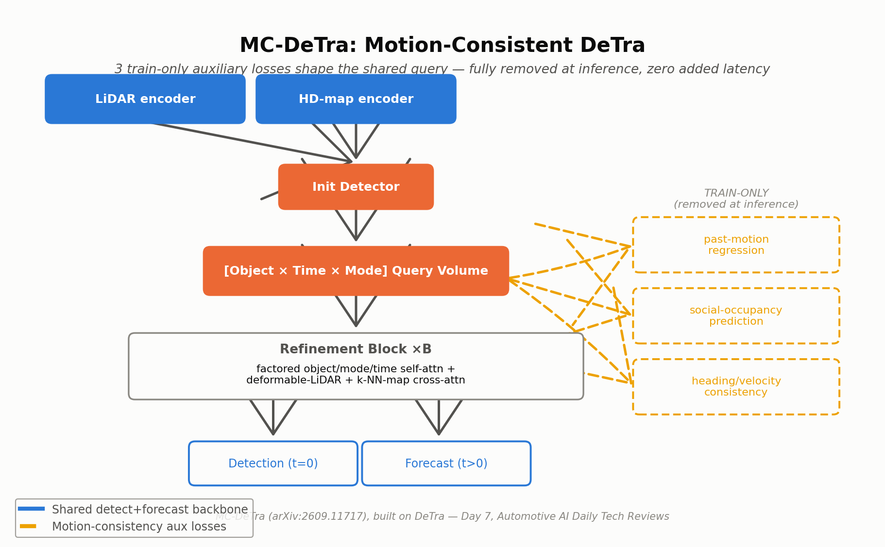
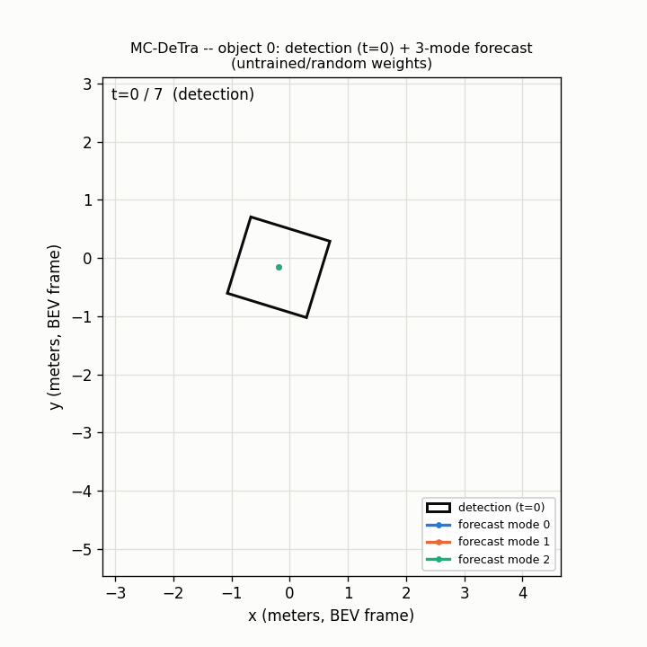

# Day 7 — MC-DeTra: Motion-Consistent DeTra

**Paper:** MC-DeTra: Motion-Consistent Joint Object Detection and Socially-Aware Trajectory Forecasting in Bird's-Eye-View Images
**arXiv:** [2609.11717](https://arxiv.org/abs/2609.11717) — submitted September 10, 2026
**Category:** Joint ADAS BEV perception + multi-modal trajectory forecasting — train-only motion-consistency auxiliary losses on a DeTra backbone ([arXiv:2406.04426](https://arxiv.org/abs/2406.04426), Agro et al., ECCV 2024)

## What is it?

MC-DeTra adds training-time upgrades to DeTra, the transformer unifying object detection AND multi-modal trajectory forecasting in one shared BEV query — targeting joint models' weak spot: fast, socially-crowded actors.

## Architecture



- **The blueprint:** DeTra's query-volume refinement transformer — actor queries as `[Object × Time × Mode]`, refined via factored object/mode/time self-attention plus deformable LiDAR + k-NN map cross-attention. The t=0 slice reads out as detection, t>0 slices as forecast.
- **Core innovation — three train-only motion-consistency losses** on the same shared query: (1) regress each actor's own OBSERVED PAST motion, (2) predict local BEV occupancy as a social-context signal, (3) penalize heading disagreeing with predicted-velocity direction. All three are removed at inference — zero added latency.

## Old vs. New

- **Old way:** DeTra learns motion purely from the future-trajectory loss — nothing forces the shared feature to encode true past kinematics or nearby traffic, so fast/crowded-actor forecasts can drift and heading can disagree with travel direction.
- **New way:** MC-DeTra adds targeted auxiliary supervision to the SAME representation, train-only. The deployed model is architecturally identical to DeTra — same weights, same latency, just better trained.

## Simulation



For one detected actor: the t=0 detection box is drawn first, then all K forecast-mode position trails grow simultaneously out to the T-step horizon — illustrating the shared `[Object × Time × Mode]` query volume's detection (t=0) vs. forecast (t>0) read-out. Generate your own with:
`python simulate.py --config tiny_mcdetra_cfg.yaml --out trajectory_simulation.gif`

## Repository layout

```
day-07-mc-detra/
├── README.md
├── requirements.txt
├── config.yaml
├── tiny_mcdetra_cfg.yaml    # small dims for a fast simulate.py / smoke test
├── assets/mcdetra_architecture.png
├── src/models/mc_detra.py   # InitDetector, FactoredSelfAttention, DeformableLiDARCrossAttention,
│                             # KNNMapCrossAttention, RefinementBlock, MCDeTra, MotionConsistencyLosses
├── train.py                 # synthetic-data smoke-test: forward + MotionConsistencyLosses + backward
├── simulate.py               # renders trajectory_simulation.gif
└── tests/test_forward_backward.py   # shape + gradient-coverage tests
```

## Quickstart

```bash
pip install -r requirements.txt
pytest tests/ -v          # 4/4 passed
python train.py --steps 20
python simulate.py --config tiny_mcdetra_cfg.yaml --out trajectory_simulation.gif
```

**Verified this session:** `pytest tests/ -v` — 4/4 passed (forward shapes for detection boxes / forecast offsets / headings / positions, the t=0-position anchoring identity, all three motion-consistency losses computing finite values, and a combined backward pass confirming every one of the 105 parameter tensors in this reference config receives a finite gradient). `python train.py --steps 5` — all three loss terms print and move each step. `python simulate.py` — renders a real 8-frame GIF end to end.

## Limitations

- The 3 losses COMPETE for gradient influence on the shared backbone — naive weighting trades one off another.
- Still LiDAR + HD-map dependent — no direct transfer to camera-only ADAS stacks.
- Heading↔velocity consistency is genuinely wrong during skids/reversing-while-turning.
- No official DeTra code exists publicly — this and the surrounding backbone are original reconstructions, not a byte-for-byte reproduction of either paper's own code.

## Sourcing / reconstruction note

Every attempt to fetch MC-DeTra's own full arXiv HTML/PDF text in the original research session returned HTTP 429 or a dead end; only the arXiv abstract page (which contains no numbers) was used as source material, with the refinement-block internals separately grounded in Waabi's own public description of the underlying DeTra backbone. **This code file is a fresh reconstruction written in a later session** that did not have access to the original package's files (each scheduled run is a separate, isolated container) — only the `MotionConsistencyLosses` module (the paper's actual novel contribution) survived verbatim in the project log; the surrounding backbone (`InitDetector`, `FactoredSelfAttention`, `DeformableLiDARCrossAttention`, `KNNMapCrossAttention`, `MCDeTra`) is newly written from the architecture description and verified to run end-to-end in this session (parameter count and exact shapes will differ from whatever the original, inaccessible package reported). No quantitative benchmark numbers are claimed anywhere in this package — the paper's own abstract contains none, and none are invented.

## Citation

```bibtex
@article{mcdetra2026,
  title   = {MC-DeTra: Motion-Consistent Joint Object Detection and Socially-Aware Trajectory Forecasting in Bird's-Eye-View Images},
  journal = {arXiv preprint arXiv:2609.11717},
  year    = {2026}
}
```

This is an independent, best-effort reference implementation for educational purposes — it is **not** the authors' official code release.

Sources:
- [MC-DeTra (arXiv:2609.11717)](https://arxiv.org/abs/2609.11717)
- [DeTra (arXiv:2406.04426)](https://arxiv.org/abs/2406.04426)
- [DeTra — Waabi Research](https://waabi.ai/research/detra)
