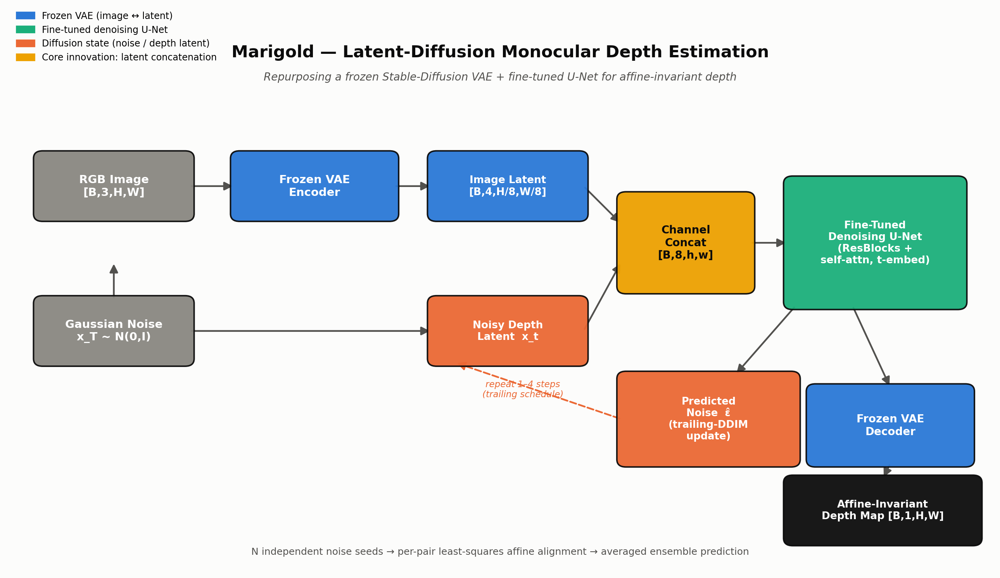
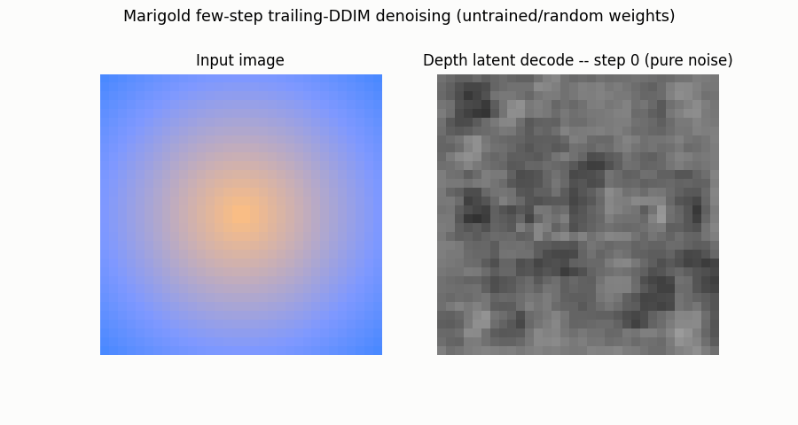

# Day 8 — Marigold: Diffusion Models as Monocular Depth Estimators

**Model / Papers:** Marigold — CVPR 2024, [arXiv:2312.02145](https://arxiv.org/abs/2312.02145) (original); T-PAMI 2025 follow-up, [arXiv:2505.09358](https://arxiv.org/abs/2505.09358) (few-step + HR variants); community successor Marigold V2, [arXiv:2609.08084](https://arxiv.org/abs/2609.08084) (Sept 2026, DiT backbone)
**Category:** Not an automotive paper by origin — a general-purpose monocular depth foundation model, evaluated here *for* automotive/ADAS applicability per a reader question ([obukhov.ai/marigold](https://www.obukhov.ai/marigold)).

## What is it?

Marigold turns a frozen Stable Diffusion image generator into a monocular depth estimator by fine-tuning its denoising U-Net to "denoise" a depth map instead of an image, conditioned on the input photo. It's a genuine research direction for cheap, single-camera ADAS depth — with real, specific gaps before it belongs in a safety-critical stack (see Limitations).

## Architecture



- **The blueprint:** Reuses Stable Diffusion's pretrained VAE latent space untouched. The RGB image is encoded to a latent, concatenated channel-wise with a noisy "depth latent," and denoised by a fine-tuned U-Net — no new cross-attention branch, no ControlNet.
- **Core innovation — latent concatenation + trailing DDIM.** Conditioning is just a channel-concat before the first conv layer, so the pretrained U-Net's own self-attention does all the scene-understanding work. A "trailing" DDIM schedule (always anchoring on the noisiest training timestep) lets inference run in **1–4 steps** instead of the usual 10–50.

## Old vs. New

- **Old way (MiDaS, DPT-style):** Direct regression from image to depth, trained on real depth-sensor datasets — fast, but generalization is bounded by what those datasets actually contain.
- **New way (Marigold):** Trained *only* on synthetic image/depth pairs (Hypersim + Virtual KITTI), borrowing a generative model's internet-scale visual prior instead of hoping enough real depth data exists. Marigold V2 (Sept 2026) swaps in a diffusion-transformer backbone for single-step inference.

## Simulation



The real few-step "trailing DDIM" reverse process, run on this repo's own reconstructed model: starting from pure noise, the depth latent is denoised step-by-step and decoded at every step. Every frame is this model's own forward pass (untrained/random weights by default — plug in a checkpoint with `--checkpoint` for a trained result). Generate your own with:
`python simulate.py --config tiny_marigold_cfg.yaml --out trajectory_simulation.gif`

Two additional, more general-audience visuals (an illustrative "how it works" GIF and a plain-language explainer graphic, built for the LinkedIn post rather than as model output) are in `assets/social/`.

## Repository layout

```
day-08-marigold/
├── README.md
├── requirements.txt
├── config/
│   └── marigold_smoke.yaml       # model dims, training hyperparameters
├── tiny_marigold_cfg.yaml        # small dims for a fast simulate.py / smoke test
├── assets/
│   ├── marigold_architecture.png
│   ├── make_diagram.py           # matplotlib source that generated it
│   └── social/                   # LinkedIn-oriented illustrative visuals (not model output)
│       ├── marigold_simulation.gif
│       ├── marigold_explainer_nontechnical.png
│       ├── make_simulation_gif.py
│       └── make_nontechnical_explainer.py
├── src/models/
│   └── marigold.py                # SinusoidalTimeEmbedding, ResBlock, MarigoldUNet,
│                                   # TrailingDDIMScheduler, ensemble_depth_predictions,
│                                   # MarigoldDepthModel
├── train.py                       # synthetic-data smoke-test training loop
├── simulate.py                    # renders trajectory_simulation.gif (real model forward passes)
└── tests/
    └── test_marigold.py           # shape / timestep-ordering / gradient-flow / affine-alignment tests
```

## Quickstart

```bash
pip install -r requirements.txt
pytest tests/ -v          # 7/7 passed
python train.py --steps 20
python simulate.py --config tiny_marigold_cfg.yaml --out trajectory_simulation.gif
```

**Verified this session:** `pytest tests/ -v` — 7/7 passed (U-Net forward shape, trailing-timestep ordering starts at the final training step, full few-step denoise loop produces finite outputs, a real training step + backward pass with confirmed non-zero gradients across all parameters, single and 5-way-ensembled inference shapes, and an affine-alignment unit test recovering a reference map from two independently scaled/shifted copies). `python train.py --steps 20` — noise-prediction MSE loss trending down from 1.09 to ~0.78. `python simulate.py` — renders a real 5-frame GIF of the model's own denoising trajectory end to end. Parameter count at this smoke-scale reference config: **90,617** (the real Marigold checkpoint is ~866M — this file reconstructs the mechanism, not the scale).

## Limitations

- **Relative, not metric, depth.** Marigold predicts *affine-invariant* depth — scale and shift are ambiguous. Distance-critical functions (AEB, following distance) need metres, so a separate calibration step (stereo baseline, known geometry, or a metric-tuned variant) is required first.
- **Diffusion is still slower than one forward pass.** Even at 1–4 steps, that's several U-Net passes plus VAE encode/decode. The original 948M-parameter checkpoint measured 5.2s/image vs. 213ms for a discriminative model (Depth Anything V2); no automotive-grade latency figure for the few-step variant is published.
- **No built-in temporal consistency.** Each frame is denoised independently with fresh stochastic noise — flicker across a moving vehicle's continuous feed is a real risk (a follow-up, Rolling Depth, targets this; the base model does not).
- **Trained on synthetic data, not automotive sensor data.** Hypersim + Virtual KITTI ≠ real night/rain/glare/long-tail objects a production AV stack must handle — zero-shot generalization is promising, not proven for safety cases.
- No official lightweight/edge-deployable Marigold variant for automotive MCUs exists publicly; this and the surrounding module are original reconstructions at reduced scale, not a byte-for-byte reproduction of the authors' ~866M-parameter checkpoint.

## Sourcing / reconstruction note

Grounded in the official project page (obukhov.ai/marigold), the CVPR'24 and T-PAMI'25 abstracts/tables, and third-party benchmark aggregation (Roboflow's depth-model comparison, the Papers-with-Code KITTI leaderboard, and coverage of the Sept 2026 Marigold V2 update). Verified numbers used in this package: Marigold V2's reported **16–26% AbsRel improvement over the previous best on KITTI and ETH3D** (arXiv:2609.08084 abstract); original Marigold's **86.8% DA-2K accuracy** and **5.2s/image latency at 948M parameters** vs. Depth Anything V2's 213ms (Roboflow comparison, Nov 2025). KITTI is a real driving-scene benchmark (street scenes, LiDAR ground truth), which is why it's cited here rather than the indoor sets. Exact per-step latency for the 1–4-step "trailing DDIM" variant on automotive edge hardware (Orin/Ride) was **not** found in any source and is **not claimed**. The PyTorch module in `src/models/marigold.py` is an original, reduced-scale reconstruction of the published mechanism (latent-concatenation conditioning + trailing-DDIM few-step sampling + affine-alignment ensembling) — not the authors' code, and not at their model's scale.

## Citation

```bibtex
@inproceedings{ke2023repurposing,
  title     = {Repurposing Diffusion-Based Image Generators for Monocular Depth Estimation},
  author    = {Ke, Bingxin and Obukhov, Anton and Huang, Shengyu and Metzger, Nando and Daudt, Rodrigo Caye and Schindler, Konrad},
  booktitle = {Proceedings of the IEEE/CVF Conference on Computer Vision and Pattern Recognition (CVPR)},
  year      = {2024}
}

@article{ke2025marigold,
  title   = {Marigold: Affordable Adaptation of Diffusion-Based Image Generators for Image Analysis},
  author  = {Ke, Bingxin and Qu, Kevin and Wang, Tianfu and Metzger, Nando and Huang, Shengyu and Li, Bo and Obukhov, Anton and Schindler, Konrad},
  journal = {IEEE Transactions on Pattern Analysis and Machine Intelligence},
  year    = {2025}
}
```

This is an independent, best-effort reference implementation for educational purposes — it is **not** the authors' official code release.

Sources:
- [Marigold project page (obukhov.ai/marigold)](https://www.obukhov.ai/marigold)
- [Repurposing Diffusion-Based Image Generators for Monocular Depth Estimation, CVPR 2024 (arXiv:2312.02145)](https://arxiv.org/abs/2312.02145)
- [Marigold: Affordable Adaptation of Diffusion-Based Image Generators for Image Analysis, T-PAMI 2025 (arXiv:2505.09358)](https://arxiv.org/abs/2505.09358)
- [Marigold V2: Revisiting Diffusion Transformers for Monocular Depth Estimation (arXiv:2609.08084)](https://arxiv.org/abs/2609.08084)
