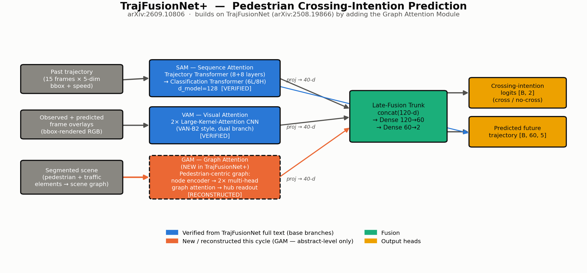
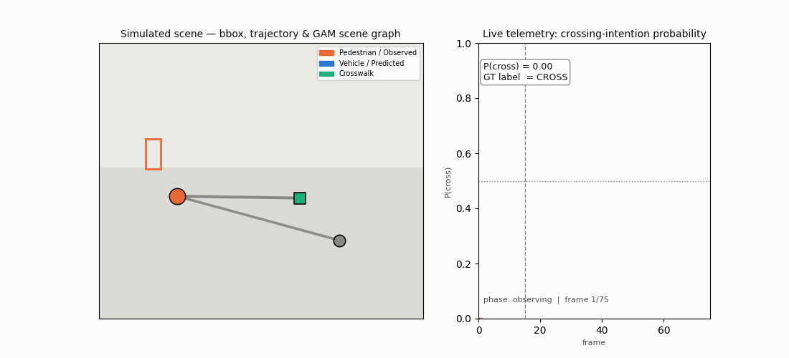

# Day 9 — TrajFusionNet+

**Paper:** TrajFusionNet+: Transformer-Based Prediction of Pedestrian Crossing Intention via Fusion of Trajectory Representations and Scene Graphs
**arXiv:** [2609.10806](https://arxiv.org/abs/2609.10806) — submitted September 9, 2026
**Authors:** François G. Landry, Moulay A. Akhloufi
**Builds on:** TrajFusionNet ([arXiv:2508.19866](https://arxiv.org/abs/2508.19866)) — same authors, August 2026

## Architecture



TrajFusionNet+ predicts whether a pedestrian is about to cross the road, from an autonomous vehicle's point of view, by fusing three branches:

- **SAM** (Sequence Attention Module) — a trajectory-forecasting transformer + a classification transformer reading the past+predicted bounding-box sequence. **Verified** from the base TrajFusionNet's full text.
- **VAM** (Visual Attention Module) — dual large-kernel-attention CNN branches over bbox-overlaid frames. **Verified** from the base TrajFusionNet's full text.
- **GAM** (Graph Attention Module) — **new in TrajFusionNet+**: extracts a pedestrian-centric scene graph from a segmented frame (pedestrian hub + traffic-element satellites: vehicles, crosswalks, static context) and runs multi-head graph attention to capture relational dependencies (e.g. an approaching vehicle, a nearby marked crosswalk) before late-fusing with SAM and VAM.

## Sourcing note (read before treating this as ground truth)

This package was assembled the same cycle the paper was discovered, under the same arXiv rate-limiting that has affected nearly every day of this series: every attempt to fetch TrajFusionNet+'s own full HTML/PDF text (`arxiv.org/html`, `arxiv.org/pdf`, an `ar5iv.labs.arxiv.org` mirror not yet processed for this very recent ID, an `alphaxiv.org` PDF mirror blocked by robots.txt, and a Semantic Scholar search) returned HTTP 429 or a dead end. What's independently **verified**:

- The full abstract of TrajFusionNet+ (three-branch architecture: SAM/VAM/GAM, PIE + JAAD datasets, a new joint-training cross-dataset evaluation protocol, claimed state-of-the-art results).
- The **complete architecture and results of the base TrajFusionNet** (arXiv:2508.19866), fetched in full this cycle: exact SAM/VAM dimensions (d_model=128, 15-frame past / 60-frame future window, dual VAN-B2 visual branches, 80→40→2 late-fusion trunk) and its verified benchmark numbers (PIE: 92% accuracy / 0.91 AUC / 0.86 F1, beating PedAST-GCN's 0.83 F1; JAADall: 89% accuracy / 0.72 F1; JAADbeh: 74% accuracy / 0.82 F1).

What's **not verified and not claimed as accurate to the TrajFusionNet+ paper**: the GAM's exact node taxonomy, edge-construction rule, GNN layer count/dimensions, the exact three-branch fusion-trunk width, and the paper's own new quantitative results table (the abstract states "improved state-of-the-art performance" and "superior generalization" without attaching numbers reachable this cycle). `src/models/gam.py` implements a good-faith structural reconstruction — standard Graph Attention Network mechanics, following the base model's own verified conventions wherever a direct analogue exists — and flags this in its own docstring. If a future run revisits this paper, retry the full-text fetch to backfill the GAM's exact specification and the new results table.

## Verified (this session)

The full model was executed end-to-end (PyTorch 2.14, CPU):
- `pytest tests/ -v` → **4/4 passed** (graph-construction shape checks, GAM forward+backward gradient-flow check, full `TrajFusionNetPlus` forward+backward with every one of its parameters receiving a gradient).
- `python train.py --config config.yaml` → real forward/backward training loop on the synthetic pedestrian-scene generator (full-scale config: **7.01M parameters** — SAM 5.71M / VAM 0.88M / GAM 0.41M — forward pass in ~0.2s CPU).
- `python simulate.py --config config.yaml` → renders `trajectory_simulation.gif` (see below) with a real (lightly burn-in-trained) model producing the crossing-intention probability and predicted trajectory shown.

## Simulation



`simulate.py` runs a short synthetic-data training burn-in (so the "model prediction" overlay is a real, if lightly trained, forecast rather than a random-init projection), then renders an animated overlay of one held-out scene:

- **Left panel:** the simulated road scene — the pedestrian's observed trajectory (solid orange), the model's predicted future trajectory (dashed blue), the ground-truth future trajectory (dotted grey), the current bounding box, and the live GAM pedestrian-centric scene graph (edge thickness/opacity = the model's actual learned attention weight to each vehicle/crosswalk node).
- **Right panel:** live telemetry — the model's crossing-intention probability curve frame-by-frame, with the observation→forecast phase boundary marked.

No real dashcam footage, PIE/JAAD data, or segmentation model is bundled (out of scope for a from-scratch repo); the scene, trajectories, and graph are all generated by `src/utils/synthetic_scene.py`'s physically-plausible synthetic generator.

## Folder structure

```
day-09-trajfusionnet-plus/
├── README.md
├── requirements.txt
├── config.yaml                        # full-scale model config (matches verified TrajFusionNet dims)
├── tiny_trajfusionnetplus_cfg.yaml     # tiny config for fast smoke-testing
├── assets/
│   └── trajfusionnetplus_architecture.png
├── scripts/
│   └── render_architecture.py         # regenerates the architecture diagram
├── src/
│   ├── models/
│   │   ├── __init__.py
│   │   ├── gam.py                     # Graph Attention Module — the paper's core new contribution
│   │   ├── sam.py                     # Sequence Attention Module (trajectory + classification transformers)
│   │   ├── vam.py                     # Visual Attention Module (dual large-kernel-attention CNN)
│   │   └── trajfusionnet_plus.py       # top-level model: SAM + VAM + GAM -> late fusion -> outputs
│   └── utils/
│       ├── __init__.py
│       └── synthetic_scene.py         # synthetic pedestrian-crossing scene generator (train/simulate)
├── train.py                            # training loop entrypoint
├── simulate.py                         # real-time synthetic overlay simulation -> trajectory_simulation.gif
├── trajectory_simulation.gif
└── tests/
    ├── test_gam.py                     # graph construction + GAM forward/backward
    └── test_model.py                   # end-to-end TrajFusionNetPlus forward/backward
```

## Quickstart

```bash
pip install -r requirements.txt
pytest tests/ -v
python train.py --config tiny_trajfusionnetplus_cfg.yaml --steps 20   # fast smoke test
python train.py --config config.yaml --steps 200                      # full-scale training loop
python simulate.py --config config.yaml --out trajectory_simulation.gif --burn-in-steps 350
```

## Sources

- [TrajFusionNet+: Transformer-Based Prediction of Pedestrian Crossing Intention via Fusion of Trajectory Representations and Scene Graphs (arXiv:2609.10806)](https://arxiv.org/abs/2609.10806)
- [TrajFusionNet: Pedestrian Crossing Intention Prediction via Fusion of Sequential and Visual Trajectory Representations (arXiv:2508.19866)](https://arxiv.org/abs/2508.19866)
