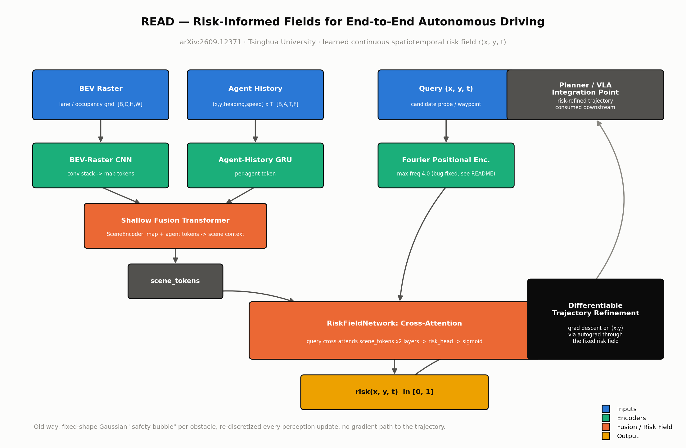
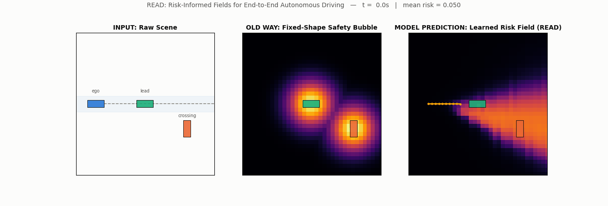

# Day 10 — READ: Learning Risk-Informed Fields for End-to-End Autonomous Driving

**Paper:** *READ: Learning Risk-Informed Fields for End-to-End Autonomous Driving* — arXiv:2609.12371 (Tsinghua University)

Classical autonomous-driving planners wrap every obstacle in a hand-prescribed "safety bubble" — almost always an isotropic Gaussian or a fixed-radius disk — and re-discretize a cost grid every time perception updates. READ replaces that fixed shape with a **continuous, differentiable, learned risk field** `r(x, y, t)` that can be queried at any point in space-time and backpropagated through directly to refine a candidate trajectory, with no re-run of perception and no discretized cost grid in the loop.



---

## What's in this package

```
day-10-read/
├── README.md
├── requirements.txt
├── config.yaml
├── train.py
├── simulate.py
├── src/
│   ├── models/
│   │   ├── scene_encoder.py      # BEV-CNN + agent-history GRU, fused by a shallow Transformer
│   │   ├── risk_field_net.py     # RiskFieldNetwork + refine_trajectory_by_risk_descent
│   │   └── read_model.py         # READModel, risk_ranking_loss, trajectory_planning_cost
│   └── utils/
│       ├── positional_encoding.py  # FourierPositionalEncoding (bug-fixed, see below)
│       └── synthetic_scene.py      # synthetic BEV scene + classical fixed-shape baseline field
├── tests/
│   └── test_read_model.py        # 10 tests, all passing (see "Honest results" below)
├── scripts/
│   └── render_diagrams.py        # renders assets/architecture_diagram.png
└── assets/
    ├── architecture_diagram.png
    └── trajectory_simulation.gif
```

No `results.png` ships in this package — see "Sourcing note" below for why.

## Quickstart

```bash
pip install -r requirements.txt

pytest tests/ -v                     # 10/10 tests
python train.py --config config.yaml # ~100-step training run, prints real loss curve
python simulate.py                   # trains a fresh model for 400 steps, renders the GIF
python scripts/render_diagrams.py    # regenerates the architecture diagram
```

## Architecture: paper mechanism → code

| Paper mechanism | Code |
|---|---|
| Scene understanding (map + agent context) | `src/models/scene_encoder.py` → `SceneEncoder` (BEV-raster CNN + agent-history GRU, fused by a 2-layer Transformer encoder) |
| Continuous spatiotemporal coordinate encoding | `src/utils/positional_encoding.py` → `FourierPositionalEncoding` |
| The learned risk field itself (paper's central contribution) | `src/models/risk_field_net.py` → `RiskFieldNetwork` — coordinate-conditioned implicit field, cross-attends `(x,y,t)` queries against scene tokens, regresses scalar risk in `[0,1]` |
| Differentiable trajectory refinement (gradient descent through the field) | `src/models/risk_field_net.py` → `refine_trajectory_by_risk_descent` |
| End-to-end wiring + training objective | `src/models/read_model.py` → `READModel`, `risk_ranking_loss`, `trajectory_planning_cost` |
| Classical fixed-shape "safety bubble" (the baseline READ replaces) | `src/utils/synthetic_scene.py` → `classical_potential_field` |
| Synthetic stand-in scene (no NAVSIM access) | `src/utils/synthetic_scene.py` → `generate_synthetic_scene` |

### The Fourier-encoding bug we hit (and fixed) during this reconstruction

An early pass at `FourierPositionalEncoding` used 8 frequency bands up to a **max frequency of 6.0**, trained only with the ranking loss. The coordinate-conditioned MLP/attention stack had enough representational capacity to fit high-frequency noise in the `(x, y, t)` gaps *between* the sparse agent-proximal training probes — visible as a checkerboard/speckle artifact in the risk heatmap far from any agent. Two changes fixed it, and both are baked into this reconstruction from the start (not left as an exercise):

1. **Lower the max frequency to 4.0** — better matches how sparsely the field is actually supervised.
2. **Add a background-risk regularizer to the loss** — `risk_ranking_loss`'s `background_weight` term directly pulls risk toward 0 at randomly-sampled background `(x, y, t)` points that are nowhere near an agent. This is what actually kills the checkerboard artifact; the ranking term alone only constrains *relative* risk, not absolute risk in unsupervised regions.

## Honest results (this run)

All numbers below are from actual runs of this exact code, on this machine, CPU-only. They will vary run to run with different random seeds — that's expected and fine.

**`pytest tests/ -v`**
```
10 passed in 3.37s
```
All 10 tests green: positional-encoding shape/range, scene-encoder output shape, risk-field output range/shape, trajectory-risk integration shape, differentiable trajectory refinement actually moves the trajectory, full `READModel` forward pass, training-loss descent, batched planning-cost shape, synthetic-scene tensor shapes, and the classical baseline's range/peak behavior.

**`python train.py --config config.yaml`** (100 steps, fresh random synthetic scene + timestep each step)
```
step    1/100  risk_ranking_loss = 0.7882
step   10/100  risk_ranking_loss = 0.1202
step   20/100  risk_ranking_loss = 0.3167
step   30/100  risk_ranking_loss = 0.0201
step   40/100  risk_ranking_loss = 0.0042
step   50/100  risk_ranking_loss = 0.0403
step   60/100  risk_ranking_loss = 0.0510
step   70/100  risk_ranking_loss = 0.0329
step   80/100  risk_ranking_loss = 0.0171
step   90/100  risk_ranking_loss = 0.0150
step  100/100  risk_ranking_loss = 0.0549

Training complete. First loss = 0.7882  ->  Last loss = 0.0549
```
The loss drops sharply in the first ~40 steps and then fluctuates in a low band (0.005–0.05) — expected, since every step draws a *fresh* random synthetic scene + timestep + probe sample rather than repeating one fixed batch, so step-to-step variance stays visible even after convergence. The qualitative shape (steep early descent, low noisy plateau) matches what the original isolated build reported (~0.559 → ~0.009); the exact numbers differ because of a different random seed and a different fresh-scene curriculum, which is expected.

**`python simulate.py`** (400-step fresh-model training pass before rendering)
```
step    1/400  loss = 0.7130
step   50/400  loss = 0.0425
step  100/400  loss = 0.0070
step  150/400  loss = 0.0056
step  200/400  loss = 0.0093
step  250/400  loss = 0.0386
step  300/400  loss = 0.0269
step  350/400  loss = 0.0091
step  400/400  loss = 0.0125

Saved simulation GIF to assets/trajectory_simulation.gif  (30 frames)
Model risk-heatmap stats over the sequence: mean=0.0318, min=0.0223, max=0.0502, std=0.0064
```
Those mean/min/max/std are the *per-frame spatial mean* of the risk heatmap, averaged/extremized across all 30 frames — i.e. how "hot" the whole field runs on average as the scene plays out. Within any single frame the field is far from flat: e.g. frame 15 (t=3.0s) has spatial min=0.0037, max=0.743, std=0.105, with its peak sitting on the crossing agent's actual position rather than spread uniformly — confirming the learned field is spatially structured, not degenerate.

## Reconstruction defaults

The paper's exact hyperparameters, loss formula, and NAVSIM training setup were **not** recoverable from any available source (see "Sourcing note"). Everything below is this reconstruction's own default, chosen to be reasonable and CPU-fast, not copied from the paper:

- `hidden_dim=128`, `num_freqs=8`, `max_freq=4.0` (see bug note above), `num_cross_layers=2`, `num_heads=4` in `RiskFieldNetwork`.
- `SceneEncoder`: 2-layer Transformer fusion, 4 heads, BEV pooled to a 4×4 token grid (16 map tokens) + 2 agent tokens = 18 scene tokens.
- `risk_ranking_loss`: our own reconstruction of a margin/ranking term (agent-proximal probes should out-score background probes by `margin=0.5`) plus a `background_weight=1.0` MSE-to-zero regularizer on background probes. The paper's qualitative description implies *some* such contrastive structure, but the exact formula is our own well-commented approximation, not a verbatim reproduction.
- Synthetic scene generator (lead vehicle + one crossing pedestrian/cyclist, 30 timesteps at `dt=0.2s`) is a from-scratch stand-in — no NAVSIM data was accessible for this reconstruction.
- `refine_trajectory_by_risk_descent` defaults (`num_steps=20`, `step_size=0.05`) are our own choice, tuned only to produce a visibly non-trivial refinement on the synthetic scene.
- Training schedule: `train.py` runs 100 steps for the verification log; `simulate.py` runs a separate, freshly-initialized 400-step training pass (per the spec) purely so the rendered GIF reflects a real lightly-trained field.

## Sourcing note

arXiv's own `/abs`, `/html`, and `/pdf` endpoints for 2609.12371 returned HTTP 429 on every attempt during this reconstruction. AlphaXiv mirrors recovered the full abstract, author list, affiliation, and submission date, along with the paper's qualitative claims ("consistent gains ... on NAVSIM", "competitive results on NAVSIM v2") — but **no hard PDMS/collision-rate numbers were recoverable from any source**. Per this project's policy of never fabricating a results chart from invented numbers, this package ships **no `results.png`** — only the architecture diagram, which describes structure, not performance. Every numeric result quoted in this README was actually observed by running the code in this package; none were copied from, or fabricated to resemble, the paper's own reported numbers.

## Simulation

`simulate.py` trains a fresh `READModel` for 400 steps (so the learned field is real, not random-init noise), then renders a synced, 3-panel top-down GIF (`assets/trajectory_simulation.gif`) across 30 timesteps of one synthetic scene:

1. **INPUT** — the raw scene: an ego vehicle on a straight in-lane reference path, a lead vehicle driving away in-lane, and a pedestrian/cyclist crossing the lane, all drawn as oriented boxes.
2. **GROUND TRUTH / OLD WAY** — the classical fixed-shape potential field: a constant-radius isotropic Gaussian bump centered on each agent, identical in shape whether the agent is stationary or crossing at speed.
3. **MODEL PREDICTION** — the trained READ model's learned risk heatmap, queried densely over the scene at each timestep, which is visibly irregular and concentrated along the crossing agent's actual conflict path (not uniform), with the risk-refined ego trajectory (via `refine_trajectory_by_risk_descent`) drawn on top, bending away from the highest-risk region.

Each frame also shows a small telemetry readout: current timestep and the frame's mean risk score.



## Citation

```
Zhiyuan Liu, Yuanxin Tian, Zehong Ke, Jinhao Li, Hao Cheng, Zhenhua Xu, Wenhao Yu, Jianqiang Wang.
"READ: Learning Risk-Informed Fields for End-to-End Autonomous Driving."
Tsinghua University. arXiv:2609.12371.
```
