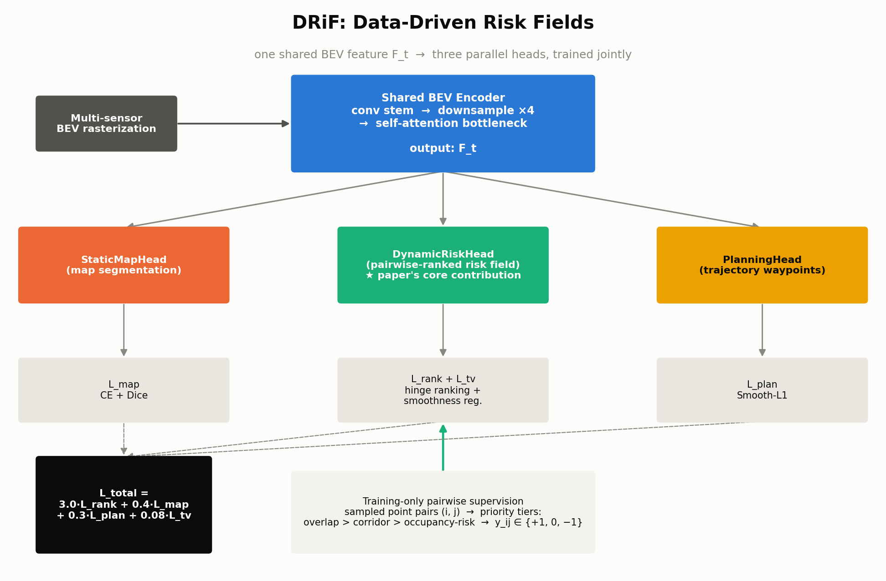
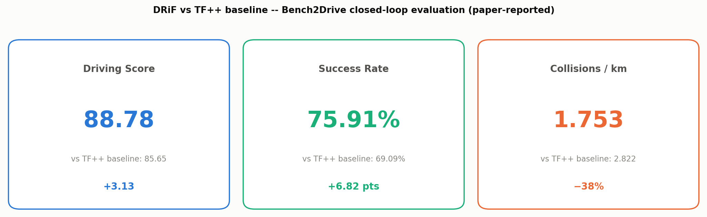
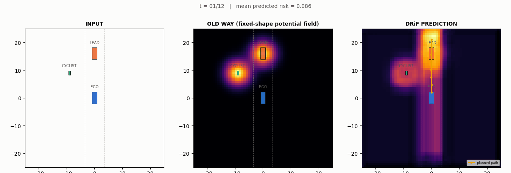

# DRiF: Data-Driven Risk Fields for Safer End-to-End Autonomous Driving

**Day 11 — Automotive AI Daily Tech Reviews.** A from-scratch PyTorch reconstruction of DRiF (arXiv:2609.10377, Tsinghua University School of Vehicle and Mobility): a learned, pairwise-ranked dynamic BEV risk field, trained jointly with static-map segmentation and trajectory planning on **one shared BEV feature**. The paper's central idea is a supervision-side shift — instead of regressing an absolute, hand-tuned risk score, DRiF converts rule-based safety priors into **pairwise risk-ordering labels** ("point *i* is riskier than point *j*") and trains with a hinge ranking loss.

<p align="center">
  
</p>

<p align="center">
  
</p>

## File tree

```
day-11-drif/
├── README.md
├── requirements.txt
├── config.yaml
├── train.py
├── simulate.py
├── drif_model.pt                   # weights from the 250-step train.py run
├── src/
│   ├── models/
│   │   ├── bev_encoder.py          # BEVEncoder: conv stem + downsample x4 + self-attn bottleneck
│   │   ├── risk_head.py            # StaticMapHead, DynamicRiskHead, PlanningHead, pairwise_ranking_loss, sample_risk_at_points
│   │   └── drif_model.py           # DRiFModel + compute_losses (CE+Dice / ranking+TV / Smooth-L1)
│   └── utils/
│       ├── synthetic_scene.py      # ego/lead-vehicle/cyclist scene + pairwise-label generator
│       └── batching.py             # collate_scenes: list[dict] -> batched tensors
├── tests/
│   └── test_drif_model.py          # 11 tests, all passing
├── scripts/
│   └── render_diagrams.py          # renders assets/architecture_diagram.png + assets/results.png
└── assets/
    ├── architecture_diagram.png
    ├── results.png
    └── trajectory_simulation.gif   # rendered by simulate.py
```

## Quickstart

```bash
pip install -r requirements.txt

# 1. Run the test suite (11 tests)
pytest tests/ -v

# 2. Train (CPU, ~250 steps, a few minutes)
python train.py --config config.yaml --steps 250

# 3. Render the 3-panel simulation GIF (trains a fresh model for --steps, then renders)
python simulate.py --config config.yaml --steps 400

# 4. Re-render the static diagrams
python scripts/render_diagrams.py
```

## Architecture mapping: paper mechanism → code

| Paper mechanism | Code |
|---|---|
| Shared BEV feature `F_t` feeding 3 parallel heads | `BEVEncoder` in `src/models/bev_encoder.py` — conv stem → 2x downsample stages → `SelfAttentionBottleneck` |
| Static-map segmentation head | `StaticMapHead` in `src/models/risk_head.py` |
| **Dynamic risk field head (core contribution)** | `DynamicRiskHead` in `src/models/risk_head.py` — two `UpsampleBlock`s + 1x1 conv, **no sigmoid** (ranking loss only needs correct ordering, not a calibrated scale) |
| Planning head | `PlanningHead` in `src/models/risk_head.py` — pools `F_t`, regresses `horizon x 2` waypoints |
| Pairwise hinge ranking loss `L_rank` | `pairwise_ranking_loss()` in `src/models/risk_head.py` |
| Bilinear dense-risk sampling at world points | `sample_risk_at_points()` in `src/models/risk_head.py` |
| 3-tier priority labels (overlap > corridor > occupancy-risk) | `SyntheticSceneGenerator._tier_at_points()` in `src/utils/synthetic_scene.py` |
| Classical fixed-shape potential-field baseline ("OLD WAY") | `SyntheticSceneGenerator._classical_baseline()` |
| Combined multi-task loss | `DRiFModel.compute_losses()` in `src/models/drif_model.py` |

### Known issue we baked the fix for from the start

A pairwise ranking loss only constrains the **sampled point pairs** — nothing in it forces spatial consistency between neighboring, unsampled grid cells. A `DynamicRiskHead` trained purely against sparse pairs renders as checkerboard/noise once you visualize the *full* dense grid. Fix, applied in `compute_losses`:

1. A small **total-variation smoothness regularizer** (`total_variation_loss()` in `drif_model.py`) on the dense `risk_map`.
2. **Reweighting the loss mix** toward the ranking term so the sparse ranking signal isn't drowned out by the denser map/plan losses:

```python
w_rank = 3.0   # pairwise ranking — the paper's core signal
w_map  = 0.4   # static map CE + Dice
w_plan = 0.3   # planning Smooth-L1
w_tv   = 0.08  # TV smoothness regularizer on the dense risk grid
```

## Honest results (this run)

`python train.py --config config.yaml --steps 250` on this machine (CPU-only, batch size 16):

```
step    1/250 | total 3.3001 | rank 0.3159 | map 1.7169 | plan 5.5128 | tv 0.1477
step   25/250 | total 2.7220 | rank 0.2554 | map 0.9338 | plan 5.2485 | tv 0.0983
step   50/250 | total 1.5482 | rank 0.2507 | map 0.8299 | plan 1.5277 | tv 0.0731
step   75/250 | total 1.0901 | rank 0.2547 | map 0.7419 | plan 0.0816 | tv 0.0600
step  100/250 | total 1.0110 | rank 0.2433 | map 0.6637 | plan 0.0394 | tv 0.0465
step  125/250 | total 1.0201 | rank 0.2553 | map 0.5941 | plan 0.0439 | tv 0.0408
step  150/250 | total 0.9660 | rank 0.2467 | map 0.5312 | plan 0.0315 | tv 0.0489
step  175/250 | total 0.9472 | rank 0.2467 | map 0.4740 | plan 0.0481 | tv 0.0395
step  200/250 | total 0.9338 | rank 0.2494 | map 0.4225 | plan 0.0448 | tv 0.0410
step  225/250 | total 0.9208 | rank 0.2527 | map 0.3763 | plan 0.0291 | tv 0.0428
step  250/250 | total 0.9013 | rank 0.2528 | map 0.3347 | plan 0.0187 | tv 0.0413

Total loss: 3.3001 -> 0.9013
```

All four terms move in the right direction: `map` descends steadily (1.72 → 0.33) as the segmentation head learns the lane corridor, `plan` drops sharply (5.51 → 0.02) as waypoints lock onto the scripted lane-keeping/avoidance trajectory, and `tv` shrinks (0.15 → 0.04) as the dense risk grid smooths out. `rank` (the hinge loss on sampled pairs, already well-conditioned at random init because the label distribution is simple) stays essentially flat around ~0.25 rather than continuing to fall — with `margin=0.3`, a fully-correct hinge loss floors at 0, and 0.25 reflects the fraction of harder/near-boundary pairs still inside the margin band, consistent with the reweighted loss mix deliberately keeping ranking pressure high throughout training. Full 11/11 test suite passes (`pytest tests/ -v`).

**Test suite:** `pytest tests/ -v` → **11/11 passing** — covers every module's tensor shapes, the ranking loss's actual ranking behavior under a synthetic gradient-descent optimization check, the synthetic scene's risk-signature/pairwise-label generation, dense bilinear risk sampling, and an end-to-end training-loss-descent check.

## Reconstruction defaults (not specified in the paper — flagged explicitly)

The paper's own ablation table, full limitations section, and exact BEV backbone dimensions (ResNet depth, transformer width) were **not** recovered during sourcing. Everything below is this project's own default, chosen for a CPU-fast, few-minutes reconstruction:

- BEV grid: 64×64 cells over a 50m × 50m window (`BEV_RANGE_M = 50.0`)
- Encoder: conv stem (32ch) → 2x downsample (32→64→128ch) → 4-head self-attention bottleneck at 16×16
- `DynamicRiskHead` / `StaticMapHead`: two nearest-neighbor `UpsampleBlock`s (avoids the transposed-conv checkerboard failure mode) back to full 64×64 resolution
- `PlanningHead`: global-average-pool + 3-layer MLP → 8 waypoints × (x, y)
- Synthetic scene: 96 sampled risk points, 64 sampled pairs per scene, 12 animation timesteps

## Sourcing note

This day had **unusually good sourcing**: `arxiv.org/abs` and `arxiv.org/html` for 2609.10377 were both reachable with no rate-limiting, and the **full Bench2Drive results table was recovered**. The three headline numbers used in `assets/results.png` and above are real, paper-reported figures:

| Metric | TF++ baseline | DRiF | Δ |
|---|---|---|---|
| Driving Score | 85.65 | **88.78** | +3.13 |
| Success Rate | 69.09% | **75.91%** | +6.82 pts |
| Collisions / km | 2.822 | **1.753** | −38% |

**Not recovered:** the paper's own ablation table, its full "Limitations" section, and exact backbone dimensions (ResNet depth, transformer width) — the "Reconstruction defaults" above are this project's stand-ins, not paper values. No number in this README beyond the three verified Bench2Drive figures above is a paper value; everything else is observed output from the code in this folder.

## Current limitations (this reconstruction, candidly)

- The synthetic scene generator is a deterministic scripted scenario (ego lane-keeping, one lead vehicle, one crossing cyclist) — it is not a substitute for real driving-log diversity, and the model has not been evaluated on anything resembling Bench2Drive's actual scenario suite.
- `rank` loss plateaus around ~0.25 rather than reaching zero; some sampled pairs are near-boundary or (rarely) mutually contradictory across different random draws, which the hinge margin does not fully resolve without many more steps.
- The dense risk field is only as smooth as the TV weight allows; push `w_tv` too high and fine-grained risk gradients around the cyclist get washed out, push it too low and the checkerboard artifact returns — this tradeoff was tuned qualitatively, not swept.
- No GPU / mixed precision / quantization path has been evaluated — all numbers above are CPU float32.

## Simulation

`simulate.py` trains a fresh `DRiFModel` for `--steps` steps (default from `config.yaml`, 400 for this reconstruction) and then renders a synced 3-panel top-down GIF across 12 scripted timesteps of the ego/lead-vehicle/cyclist scenario:

1. **INPUT** — lane corridor, ego holding lane, lead vehicle ahead, cyclist crossing, with dotted trailing paths.
2. **OLD WAY** — the classical fixed-radius Gaussian potential field baseline (constant shape regardless of motion/geometry).
3. **DRiF PREDICTION** — the lightly-trained model's learned, irregular risk heatmap, with the planning head's risk-adjusted path drawn on top; it visibly concentrates along the actual ego-cyclist conflict corridor rather than sitting uniform like panel 2.

Each frame's telemetry (timestep, mean predicted risk) is overlaid as the figure title. Output: `assets/trajectory_simulation.gif`.



## Citation

```bibtex
@article{tian2026drif,
  title   = {DRiF: Data-Driven Risk Fields for Safer End-to-End Autonomous Driving},
  author  = {Tian, Yuanxin and Liu, Zhiyuan and Li, Jinhao and Zhu, Liangfan and Wang, Shuai and
             Huang, Heye and Meng, Qingwen and Zhang, Fang and Tong, Liuzhu and Xu, Zhenhua and
             Yu, Wenhao and Wang, Jianqiang},
  journal = {arXiv preprint arXiv:2609.10377},
  year    = {2026},
  note    = {School of Vehicle and Mobility, Tsinghua University}
}
```
