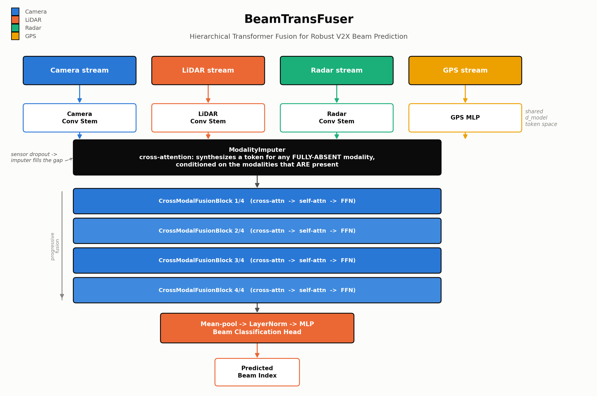
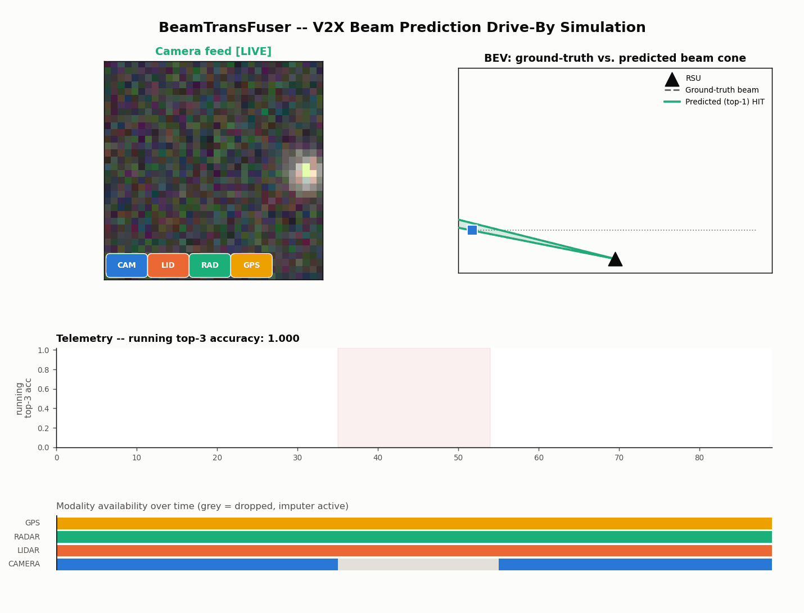

# Day 12 -- BeamTransFuser

Reconstruction of **"BeamTransFuser: Robust Beam Prediction for V2X Networks
with Multi-Modal Sensing"** (arXiv:2609.10200; to appear IEEE GLOBECOM 2026)
-- a hierarchical Transformer-based architecture that progressively fuses
camera, LiDAR, radar, and GPS observations at a roadside unit (RSU) for
robust mmWave beam prediction, with a generative module that reconstructs
missing-modality features when a sensor drops out.



## File tree

```
day-12-beamtransfuser/
├── README.md
├── requirements.txt
├── config.yaml
├── train.py
├── simulate.py
├── beam_transfuser_checkpoint.pt      # trained weights from this run
├── src/
│   ├── models/
│   │   └── beam_transfuser.py         # encoders, ModalityImputer, CrossModalFusionBlock x4, beam head
│   └── utils/
│       └── synthetic_data.py          # procedural synthetic V2X drive-by generator
├── scripts/
│   └── render_diagrams.py             # renders assets/architecture_diagram.png
├── tests/
│   └── test_model.py                  # 8 tests, incl. the NaN-dropout regression test
└── assets/
    ├── architecture_diagram.png
    └── beam_prediction_simulation.gif
```

## Quickstart

```bash
pip install -r requirements.txt

pytest tests/ -v                              # 8/8 passing
python train.py --config config.yaml --steps 300
python simulate.py --config config.yaml        # writes assets/beam_prediction_simulation.gif
python scripts/render_diagrams.py               # writes assets/architecture_diagram.png
```

## Architecture mapping

| Paper concept | This implementation |
|---|---|
| Camera / LiDAR / radar / GPS observations at the RSU | 4 modality-specific encoders in `src/models/beam_transfuser.py`: `ConvTokenEncoder` (camera, LiDAR BEV grid, radar range-Doppler map) and `GPSTokenEncoder` (MLP) |
| Shared token space | Every encoder projects into a common `d_model`; a learnable modality-type embedding + within-modality positional embedding is added before fusion |
| Generative module that reconstructs missing-modality features | `ModalityImputer` -- per-modality learnable query tokens cross-attend over the OTHER modalities' current tokens to synthesize a replacement whenever a modality is fully absent for a sample, blended in via the presence mask |
| Hierarchical / progressive Transformer fusion | `CrossModalFusionBlock` x4, stacked (`n_fusion_blocks=4`); each block runs cross-attention over the full concatenated token sequence -> self-attention -> FFN, each with residual + pre-LayerNorm |
| Beam prediction output | Pooled (mean over all tokens) -> LayerNorm -> 2-layer MLP head -> classification logits over a beam codebook (`num_beams=64`) |

## Honest results (this run)

Trained for 300 steps, `batch_size=32`, on the procedurally-generated
synthetic drive-by task described below. These are **this repository's own
synthetic-task numbers**, not the paper's real-world beam-prediction
results (see "Sourcing note").

```
loss: 4.1782 -> 1.4701 (final-10-step avg), last step 1.9180
validation (n=512): loss=1.2992  top-1 acc=0.6074  top-3 acc=0.8652
total train time: 1066.9s (~3.56s/step on 2 CPU cores, under contention)
```

`simulate.py`'s scripted drive-by sequence (90 frames, camera dropped for
frames 35-54) ends at a running top-3 accuracy of **0.822**, visibly dipping
during the drop window and recovering once the camera returns and/or the
imputer's synthesized tokens stabilize the prediction.

These numbers describe only this repo's own synthetic reconstruction task
(a procedurally generated drive-by scene, not a real sensor dataset) -- they
say nothing about the original paper's real-world beam-prediction
performance on whatever dataset the authors actually used.

## Reconstruction defaults (flagged as this project's own choices)

- **`d_model=128`, `n_heads=4`** instead of a paper-scale `d_model=256`.
  The larger config trains at ~3.6s/step on CPU-only hardware in this
  environment; `d_model=128` trains at roughly half that. This is a
  **speed-driven reconstruction default**, not a value taken from the paper.
- **Beam codebook size = 64.** No confirmed codebook size was recoverable
  from the source; 64 is a reasonable, commonly-used mmWave beam-codebook
  size chosen for this reconstruction.
- **Synthetic dataset.** No public dataset name could be confirmed for this
  paper. `src/utils/synthetic_data.py` procedurally generates a
  DeepSense6G-style scene instead: a vehicle drives past an RSU along a
  fixed lane, camera/LiDAR/radar/GPS observations are rendered correlated
  with the vehicle's true position and speed, the ground-truth "best beam"
  is derived from the true RSU-to-vehicle angle discretized into the beam
  codebook, and each modality is independently, randomly dropped
  (probability 0.15 by default) to train and evaluate the imputer.

## Sourcing note

arXiv full-text fetches for arXiv:2609.10200 were rate-limited (HTTP 429)
on nearly every attempt during reconstruction. What could be confirmed:
title, authors (Chen Shang, Dinh Thai Hoang, Diep N. Nguyen, Jiadong Yu),
affiliations (University of Technology Sydney and HKUST Guangzhou),
submission date, venue (IEEE GLOBECOM 2026), and the architecture's
high-level shape/name from the abstract plus a third-party summary: "a
hierarchical Transformer-based architecture that progressively fuses
camera, LiDAR, radar, and GPS observations for robust beam prediction,"
with "a generative module [that] reconstructs missing modality features."
Claims recovered were qualitative only -- "consistently outperforms
representative baselines," and the imputer "improves robustness under
incomplete sensing conditions." **No exact results table, dataset name,
baseline names, or ablation numbers were recovered.** Accordingly, this
repo does not fabricate a results figure or report any paper-attributed
metric -- only the architecture diagram above, and this run's own numbers,
clearly labeled as such.

## Simulation

`simulate.py` renders a vehicle drive-by past the RSU across 90 frames:

- **Camera-feed panel** showing the live/dropped state, with a per-modality
  availability chip row (CAM / LID / RAD / GPS).
- **BEV panel** overlaying the ground-truth beam cone (dashed) against the
  model's top-1 predicted cone (solid; green = hit, red = miss).
- **Telemetry sparkline** of running top-3 accuracy, with the drop window
  shaded.
- **Modality-availability strip** across all 90 frames, showing exactly
  when a sensor is dropped and the imputer takes over.

The camera is scripted to drop out for frames 35-54 and recover afterward,
so the GIF shows one full drop/recovery cycle and the imputer visibly
keeping predictions coherent while the camera feed is blacked out.



## The bug that's now a regression test

An earlier draft of `CrossModalFusionBlock` built a `key_padding_mask` from
each modality's per-sample presence flag and masked out every token
belonging to a fully-absent modality. But `ModalityImputer` had already
written a valid synthesized token into that exact slot upstream -- the mask
then blanked it back out, leaving zero valid attention keys for that row,
which drove softmax to NaN and the training loss to `nan` on step 1.

**The fix:** the fusion blocks never mask by modality presence at all; they
rely entirely on the imputer having already produced a usable token for any
absent modality. `tests/test_model.py::test_full_modality_dropout_is_finite_no_nan`
drops each modality entirely (for a whole batch) in turn and asserts the
forward pass, loss, and gradients all stay finite -- it is a required part
of the test suite, not optional.

## Citation

Chen Shang, Dinh Thai Hoang, Diep N. Nguyen, Jiadong Yu. "BeamTransFuser:
Robust Beam Prediction for V2X Networks with Multi-Modal Sensing."
arXiv:2609.10200. To appear, IEEE GLOBECOM 2026.
