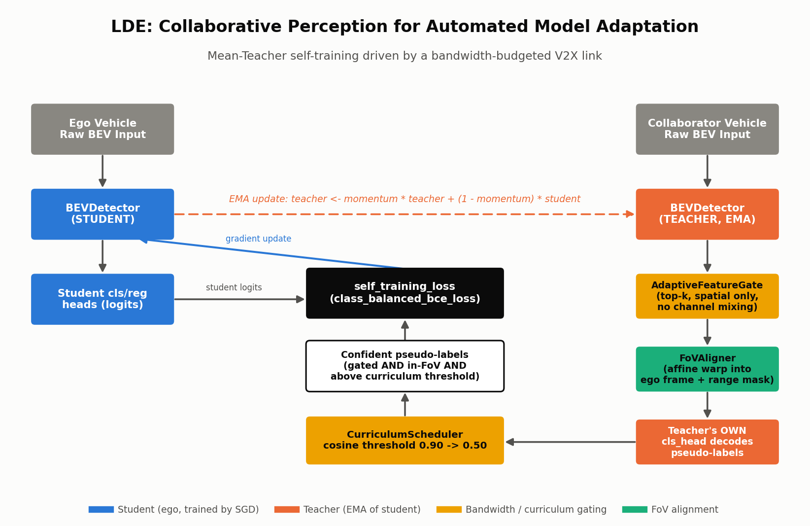

# LDE: Learning from Distributed Eyes

**Leveraging Collaborative Perception for Automated Model Adaptation**
Yanan Ma, Yihang Tao, Zhengru Fang, Zihan Fang, Yiqin Deng, Xianhao Chen, Yuguang Fang
City University of Hong Kong · Lingnan University · University of Hong Kong
arXiv:2609.18511

Unsupervised domain adaptation of an ego vehicle's 3D object detector, using a
**collaborator** vehicle's perception — shared over a bandwidth-budgeted V2X
link — as the source of pseudo-labels. The V2X link itself *is* the
supervision signal, not a sensor-fusion input: the ego never receives ground
truth, only another vehicle's (gated, warped, curriculum-filtered) opinion
about what's out there.



---

## File tree

```
day-13-lde/
├── README.md
├── requirements.txt
├── config.yaml
├── train.py
├── simulate.py
├── models/
│   ├── detector.py           # BEVDetector (shared student/teacher architecture)
│   ├── feature_sharing.py    # AdaptiveFeatureGate (purely spatial, bug #3 fix)
│   ├── fov_align.py          # FoVAligner (affine warp + range mask)
│   └── lde.py                # LDEModel (Mean-Teacher EMA loop), self_training_loss
├── src/utils/
│   ├── curriculum.py         # CurriculumScheduler (cosine decay 0.90 -> 0.50)
│   ├── losses.py             # class_balanced_bce_loss (used), sigmoid_focal_loss (reference)
│   └── data.py                # synthetic paired ego/collaborator BEV scene generator
├── scripts/
│   └── render_diagrams.py    # renders assets/architecture_diagram.png
├── tests/
│   └── test_lde.py           # 17 tests, incl. 4 explicit bug-regression tests
└── assets/
    ├── architecture_diagram.png
    ├── lde_simulation.gif
    ├── train_log.json
    └── checkpoints/          # 51 real training checkpoints used by simulate.py
```

## Quickstart

```bash
pip install -r requirements.txt

python -m pytest tests/ -v          # 17/17
python train.py --config config.yaml   # trains + saves checkpoints/train_log.json
python simulate.py --config config.yaml  # renders assets/lde_simulation.gif
python scripts/render_diagrams.py       # renders assets/architecture_diagram.png
```

## Architecture mapping

| Paper concept | This repo |
|---|---|
| Ego / collaborator detector backbone | `models/detector.py::BEVDetector` — shared architecture, used as both student and teacher |
| Mean-Teacher self-training | `models/lde.py::LDEModel` — teacher is an EMA copy of the student's weights |
| Adaptation-oriented feature sharing (bandwidth budget) | `models/feature_sharing.py::AdaptiveFeatureGate` — top-k spatial cell selection, no learned params |
| FoV filtering | `models/fov_align.py::FoVAligner` — differentiable affine warp into the ego frame + range mask |
| Curriculum learning strategy | `src/utils/curriculum.py::CurriculumScheduler` — cosine decay, confidence threshold 0.90 → 0.50 |
| Self-training objective | `models/lde.py::LDEModel.self_training_loss` → `src/utils/losses.py::class_balanced_bce_loss` |

## Honest results (this run)

These are **synthetic-proxy-task results only** — a 32×32 BEV cell grid
(1024 cells), ~6 objects per scene (~99.4% background), batch size 16, CPU,
one actual run of `train.py` with `config.yaml` defaults. They are **not**
paper-attributed numbers (none were recoverable — see Sourcing note).

**Phase 1 — teacher pretraining** (supervised `class_balanced_bce_loss` on
the collaborator's own labeled scenes, 150 steps):
loss **0.9844 → 0.0080**

**Phase 2 — main LDE self-training loop** (student trained only on teacher
pseudo-labels, 150 steps):
- loss: **6.3858 → 0.0069**
- `supervised_cells` (cells clearing gate + FoV + curriculum threshold, per
  batch of 16 scenes): **55 → 4181**, growing as the curriculum threshold
  relaxes **0.900 → 0.500** (cosine decay)
- recall proxy (fraction of the ego's own in-range true-object cells the
  student fires on at 0.5, evaluated only as a read-only diagnostic — never
  used as a training signal): **0.614 → 1.000**, reaching 1.0 by step ~10 and
  holding

The recall proxy saturates faster than a dramatic 0.0 → high curve because
the student is initialized from a perturbed copy of the (already pretrained)
teacher checkpoint rather than from scratch — see "Reconstruction defaults"
below. The `supervised_cells` growth and loss collapse are the more telling
curves for this synthetic task and both show the expected shape.

## Implementation notes: the bugs (and fixes) that made this work

All four fixes below are baked into the code as shipped — each also has a
dedicated regression test in `tests/test_lde.py`.

**Bug #1 — untrained pseudo-label head.** It's tempting to give the
pseudo-label decoder its own head. Don't: a fresh, separately-initialized
head's logits sit at `sigmoid(0) ≈ 0.5` forever, since nothing in the
training loop ever optimizes it — that confidence can never clear the
curriculum's 0.90 starting threshold, so `supervised_cells` stays pinned at
0 no matter how good the teacher's underlying features are. The fix:
`LDEModel.build_pseudo_labels` decodes pseudo-labels through
`self.teacher.cls_head` — the SAME, EMA-tracked head that trains alongside
the student. Regression test: `test_bug1_pseudo_confidence_tracks_teacher_head_not_stuck_at_half`
directly manipulates `teacher.cls_head`'s bias and confirms `pseudo_conf`
tracks it (≈1.0 or ≈0.0), rather than sitting near 0.5.

**Bug #2 — class-imbalance collapse.** With ~6 true objects on a 1024-cell
grid (~99.4% background), plain `BCE(reduction="mean")` is dominated by the
mass of easy negatives: the shared bias term gets dragged strongly negative
in the first few gradient steps (the negative-cell gradient contribution
overwhelms the positive-cell contribution by ~150:1), so the model reaches a
low *average* loss without ever confidently firing on a true object. The
fix: `class_balanced_bce_loss` averages the positive-cell loss and the
negative-cell loss **separately**, then **sums** the two averages, giving
the rare positive cells equal say regardless of the imbalance ratio.
Regression test: `test_bug2_class_balanced_beats_plain_mean_bce_on_imbalanced_scene`
trains two identically-initialized `BEVDetector`s on the same imbalanced
synthetic scene — one with `class_balanced_bce_loss`, one with plain
mean-reduced BCE — and asserts the class-balanced version ends up
confidently positive (`>0.5`) at true object cells while clearly
outperforming the plain-mean version.

**Bug #3 — feature-gate scrambling.** `AdaptiveFeatureGate` must be purely
spatial: it decides WHICH cells survive the bandwidth budget, never HOW they
look. An earlier version ran gated features through an extra untrained 1×1
`channel_reduce` conv before the teacher's head decoded them — that conv's
random weights scrambled the feature basis the already-trained head expects,
collapsing pseudo-confidence even when the teacher was genuinely confident
pre-gating. The fix: `AdaptiveFeatureGate` has zero learnable parameters —
it only multiplies by a binary spatial mask. Regression tests:
`test_feature_gate_has_no_learnable_params` (structural) and
`test_bug3_feature_gate_preserves_teacher_confidence_when_budget_full`
(functional — with `budget_ratio=1.0` and zero relative offset, pseudo-logits
from the full pipeline must exactly equal `teacher.cls_head` applied
directly to the teacher's raw features).

**Bug #4 — NaN-division guard (narrower).** If the collaborator is fully out
of range (zero cells pass FoV + curriculum filtering), any supervised-loss
normalization that naively divides by `supervised_cells` divides by zero.
The fix: `class_balanced_bce_loss` guards each class branch independently
(an absent class contributes exactly 0, never NaN), and
`LDEModel.self_training_loss` additionally short-circuits to an explicit,
still-differentiable zero loss when `confident_mask` is entirely empty.
Regression test: `test_bug4_self_training_loss_handles_zero_supervised_cells`.

## Reconstruction defaults

- BEV grid: 32×32 cells (1024 total), 8 synthetic input channels.
- ~6 objects per scene, placed randomly; each stamps a graded 5×5 signal
  block (full signal at center, decaying over two rings) into the BEV
  tensor at its location — only the exact center cell is a positive label,
  so the ring cells create a realistic confidence penumbra for the
  curriculum threshold to progressively reveal.
- Ego "sees" (has real signal for) objects within `ego_range=10` cells of
  its own center; objects further out are pure noise in the ego's own BEV
  tensor (an occlusion / limited-native-sensing proxy).
- The collaborator sits at a random integer-cell offset (±4 to ±8 cells in
  each axis) and sees objects within `collab_range=15` cells of **its own**
  center, in **its own local frame** — `FoVAligner` must correctly warp this
  into the ego frame before any comparison is meaningful (verified directly
  by `test_fov_aligner_recovers_known_object_after_warp`).
- `AdaptiveFeatureGate` budget ratio: 0.4 (40% of BEV cells survive the
  bandwidth budget). `FoVAligner` trusted-FoV radius: 16 cells.
- EMA momentum: 0.99. Curriculum: cosine decay from 0.90 to 0.50 over the
  150 steps of phase 2.
- Phase 1 pretrains a fresh `BEVDetector` on the collaborator's own labeled
  scenes (representing a source-domain-competent collaborator); its weights
  seed `LDEModel.teacher`. `LDEModel.student` starts from the same
  checkpoint, then perturbed (Gaussian noise, σ=0.9, added to every
  parameter) to represent the ego's own, not-yet-adapted local detector —
  this is why phase 2's loss starts high again despite phase 1 already
  converging.
- These are simplifications made explicit for a synthetic reconstruction —
  no rotation is applied in the ego/collaborator relative pose (translation
  only), though `FoVAligner` supports full rotation+translation for reuse.

## Sourcing note

arXiv's `/abs`, `/pdf`, and the `ar5iv` mirror all returned HTTP 429 while
sourcing this paper. A third-party reader (alphaxiv.org) recovered the
abstract, full author list and affiliations, and submission date, which are
reproduced above and in the citation below. **Not recovered:** dataset name,
baseline method names, exact numeric results, ablations, or the paper's own
stated limitations. Nothing paper-attributed is fabricated anywhere in this
repository — no `results.png` is included, and every number in "Honest
results" above is explicitly this run's own synthetic-task output, not a
paper result.

## Simulation

`simulate.py` renders `assets/lde_simulation.gif` (50 frames) directly from
the 51 real checkpoints `train.py` saves during phase 2 — never from a
random-init model. Three BEV panels plus a telemetry strip:

1. **Ego Alone (native FoV)** — static: the ego's own sensing radius and
   what it can ever see unaided.
2. **Collaborator → Gated V2X** — per-frame real teacher pseudo-label
   confidence, after `AdaptiveFeatureGate` (bandwidth budget) and
   `FoVAligner` (warp + range mask), with cells clearing that frame's
   curriculum threshold highlighted.
3. **Ego After LDE Adaptation** — per-frame real student confidence on a
   fixed demo scene, evolving as training progresses.

The bottom strip plots the curriculum threshold (declining) and
`supervised_cells` count (growing) across the full 150-step phase-2 history,
with a marker tracking the current frame's training step.

## Citation

```
Yanan Ma, Yihang Tao, Zhengru Fang, Zihan Fang, Yiqin Deng, Xianhao Chen, Yuguang Fang.
"LDE: Learning from Distributed Eyes: Leveraging Collaborative Perception
for Automated Model Adaptation." arXiv:2609.18511.
```
