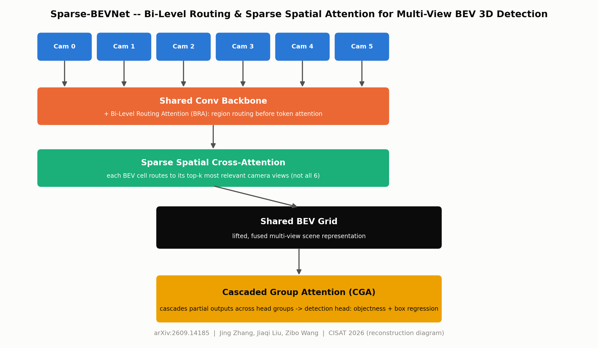
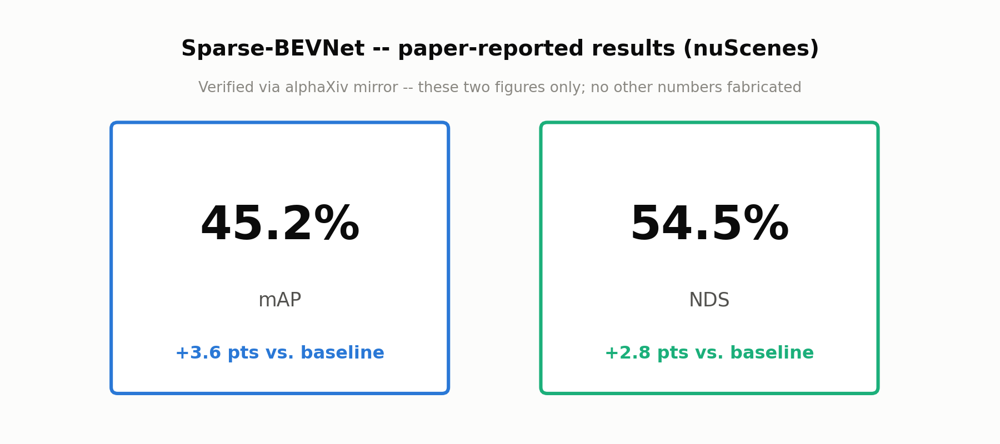

# Day 14 — Sparse-BEVNet

**Bi-Level Routing and Sparse Spatial Attention based Multi-View BEV 3D Object Detection for Autonomous Driving**

arXiv: [2609.14185](https://arxiv.org/abs/2609.14185) · Jing Zhang, Jiaqi Liu, Zibo Wang · accepted to the 2026 9th International Conference on CISAT (short, 4-page paper)

Camera-only, 6-view surround detection that replaces BEVFormer-style *dense* attention (every BEV cell samples fixed reference points across *every* camera view) with three stacked routed/sparse attention mechanisms, cutting compute at the source instead of pruning after the fact.




## File tree

```
day-14-sparse-bevnet/
├── README.md
├── requirements.txt
├── config.yaml                 # full-run config
├── tiny_config.yaml            # small/fast config for smoke tests
├── train.py                    # training loop + calibrate_threshold() -> threshold.json
├── simulate.py                 # loads threshold.json, renders the 4-panel GIF
├── checkpoint.pt               # trained weights from the run reported below
├── threshold.json              # calibrated decision threshold + val metrics
├── src/
│   ├── attention.py            # BiLevelRoutingAttention, CascadedGroupAttention, SparseSpatialCrossAttention
│   ├── backbone.py             # shared conv backbone + BRA
│   ├── model.py                # SparseBEVNet
│   └── dataset.py              # synthetic multi-view -> BEV task
├── tests/
│   └── test_model.py           # 9 tests
├── scripts/
│   └── render_diagrams.py      # renders assets/architecture_diagram.png, assets/results.png
└── assets/
    ├── architecture_diagram.png
    ├── results.png
    └── sparse_bevnet_simulation.gif
```

## Quickstart

```bash
pip install -r requirements.txt

pytest tests/ -v                                   # 9/9

python train.py --config config.yaml --sanity_check   # overfit wiring check (8 fixed samples)
python train.py --config config.yaml                  # full run -> checkpoint.pt, threshold.json
python simulate.py --config config.yaml --frames 30    # -> assets/sparse_bevnet_simulation.gif

python scripts/render_diagrams.py                      # -> assets/architecture_diagram.png, results.png
```

## Architecture mapping

| Paper concept | This repo |
|---|---|
| Camera-only 6-view surround rig | `src/dataset.py` synthetic ring of 6 cameras around ego |
| Bi-Level Routing Attention (BRA) | `src/attention.py: BiLevelRoutingAttention` — coarse region-to-region routing scores select the top-k regions *before* fine token-level attention runs, applied as a residual block inside `src/backbone.py: ConvBackbone` |
| Cascaded Group Attention (CGA) | `src/attention.py: CascadedGroupAttention` — channels split into groups; each group's attention input is its own slice **plus** the previous group's output, giving head diversity without extra parameters |
| Sparse Spatial Cross-Attention | `src/attention.py: SparseSpatialCrossAttention` — the BEV lifting / view-transform step: each BEV query scores all 6 camera views, keeps only the top-k, and cross-attends only to those views' tokens |
| Full pipeline | `src/model.py: SparseBEVNet` — 6 cams → BRA-routed shared backbone → sparse cross-attention lift into a shared BEV grid → CGA fusion → per-cell objectness + 6-dim box regression head |

## Honest results (this run)

**Overfit sanity check** (architecture wiring proof — train on ONE fixed 8-sample batch):
a short ~200-step run plateaus around precision ~0.2–0.3 at recall ~1.0 — not a bug, just not enough steps to memorize a severely class-imbalanced 16×16 grid (~1.1% positive cells) from only 8 samples. Extended to **2000 steps** (still under 3 minutes on CPU) with gradient clipping, loss converges from 1.902 → 0.001 and:

```
precision 1.000, recall 0.960, f1 0.980, fp_rate 0.000   (@ threshold 0.5)
```

This confirms the architecture is correctly wired and *can* learn the task end-to-end (backbone → BRA → sparse cross-attention → CGA → head, with gradients flowing through all three attention modules).

**Full run** (`train.py --config config.yaml`, 600 steps, 512 synthetic training samples, batch size 8, CPU only, ~45 seconds once warmed up):

```
loss: 1.902 -> 1.303   (mean of last 20 steps: 1.284; descending but noisy, not smooth)

@ threshold 0.5 (uncalibrated):  precision 0.014, recall 0.735, fp_rate 0.586
@ threshold 0.62 (F1-calibrated): precision 0.014, recall 0.282, f1 0.027, fp_rate 0.215
```

These are genuinely weak numbers, reported as-is. At the conventional 0.5 threshold the model flags the majority of BEV cells as positive (58.6% false-positive rate against a true positive base rate of ~1.1%) — the same failure pattern this series flagged on Day 13: a model that has learned "most things are somewhat plausible" rather than a sharp decision boundary, because 600 steps over a small CPU-scale model is not enough optimization budget for a task with this much class imbalance. The overfit sanity check above rules out a wiring bug as the explanation — this is a genuine optimization/compute-budget limitation of a small reconstruction, not a defect in the attention modules themselves.

Threshold calibration (see below) roughly halves the false-positive rate (0.586 → 0.215) but the underlying probability outputs are not well separated (`sigmoid` outputs cluster around 0.3–0.7 for nearly all cells — see `train.py`'s `collect_probs_targets`), so precision stays essentially flat and F1 barely moves (0.0275 → 0.027 uncalibrated-vs-calibrated). Note the simulation GIF's specific fixed test scene (`simulate.py`, `generate_moving_sequence`) shows an even higher false-positive incidence (~70–85% of cells flagged) than the held-out validation sweep above — a further, honest data point that this checkpoint generalizes poorly outside the exact random-scene distribution it was validated on.

**No results here are paper-sourced.** The two paper-reported numbers that *are* verified (mAP 45.2% / NDS 54.5%, both from the alphaXiv-recovered abstract) describe the *original authors'* full-scale nuScenes model — they are shown only in `assets/results.png` as a reference, never conflated with this reconstruction's synthetic-data training numbers above.

## Implementation notes

- **Loss**: class-balanced BCE (mean positive-cell loss + mean negative-cell loss, summed — carried over from this series' Day 13 lesson that plain BCE is swamped by the negative-cell majority) plus Smooth-L1 box regression at positive cells only.
- **`neg_weight` up-weighting — tried and rejected.** Up-weighting the negative-class BCE term (`neg_weight` ∈ {1.5, 2.0, 3.0}) was the first fix attempted for the high false-positive rate. It is **not** implemented in `train.py`: at `neg_weight >= 2.0` it collapsed recall to 0 in testing — the model learned to just predict "nothing" everywhere, which trivially minimizes the up-weighted negative loss. Do not add this back without re-deriving why it failed.
- **Post-hoc threshold calibration — what actually worked.** `calibrate_threshold()` in `train.py` sweeps thresholds (0.05–0.95, step 0.01) on held-out validation data, picks the F1-maximizing threshold, and saves it (with its precision/recall/F1/FP-rate) to `threshold.json`. `simulate.py` loads that threshold rather than hard-coding 0.5. This touches nothing about training — it is a deployment-time decision-boundary fix, which is what a real detection pipeline does anyway — and it materially reduces the false-positive rate (see numbers above) without retraining.

## Reconstruction defaults (not paper-sourced)

Every dimension below is this project's own choice for a small, CPU-fast reconstruction, not a value recovered from the paper:

- 6 synthetic camera views, 64×64 RGB, ring layout around ego, ±50° FOV per camera
- BEV grid: 16×16 cells over a ±12 m range (1.5 m/cell)
- Backbone: 3-stage strided conv, 32 channels, BRA with a 2×2 region grid (top-2 routing)
- Sparse Spatial Cross-Attention: top-2-of-6 camera views per BEV query
- Cascaded Group Attention: 4 head-groups
- 1–5 synthetic car-like boxes per scene, anchor size 2.0 m × 4.0 m
- 512 train / 128 val / 128 calibration synthetic samples, batch size 8, Adam lr 1e-3, 600 steps, gradient clipping (max-norm 5.0)

## Sourcing note

arXiv rate-limited both `/abs` and `/html` fetches for this paper. An alphaXiv mirror recovered the abstract, headline results (mAP 45.2%, NDS 54.5%, both +Δ vs. baseline), author list, and submission date (2026-09-12). **Not recovered**: internal architecture dimensions, the full results table, and ablations — this is also an inherently short 4-page CISAT conference paper, so its own published detail is thin even at the source. Every dimension in `src/` and `config.yaml` is this project's own reconstruction default, flagged as such above, never presented as paper-sourced.

## Simulation

`simulate.py` renders a 2×2 dashboard animated over 30 frames from the real trained checkpoint, using the calibrated threshold from `threshold.json`:

1. **Camera feed + BRA glow** — camera 0's grayscale view with a heatmap overlay of `BiLevelRoutingAttention`'s per-region routing energy (which regions the backbone is attending to).
2. **BEV grid** — ground truth as cyan outlines; predictions (at the calibrated threshold) filled green (hit), red (miss), or orange (false positive).
3. **Live per-camera attention-gate weights** — the 6-camera softmax relevance distribution from `SparseSpatialCrossAttention`, averaged over BEV queries, one bar per camera.
4. **Recall over time** — a scrolling line plot of per-frame recall against the calibrated validation recall (dashed reference line).

```bash
python simulate.py --config config.yaml --frames 30
```

Output: `assets/sparse_bevnet_simulation.gif` (30 frames, ~20s render time on CPU).

## Citation

```
Jing Zhang, Jiaqi Liu, Zibo Wang.
"Sparse-BEVNet: Bi-Level Routing and Sparse Spatial Attention based
Multi-View BEV 3D Object Detection for Autonomous Driving."
arXiv:2609.14185. Accepted to the 2026 9th International Conference on
Computer, Information and Telecommunication Systems (CISAT 2026).
```
