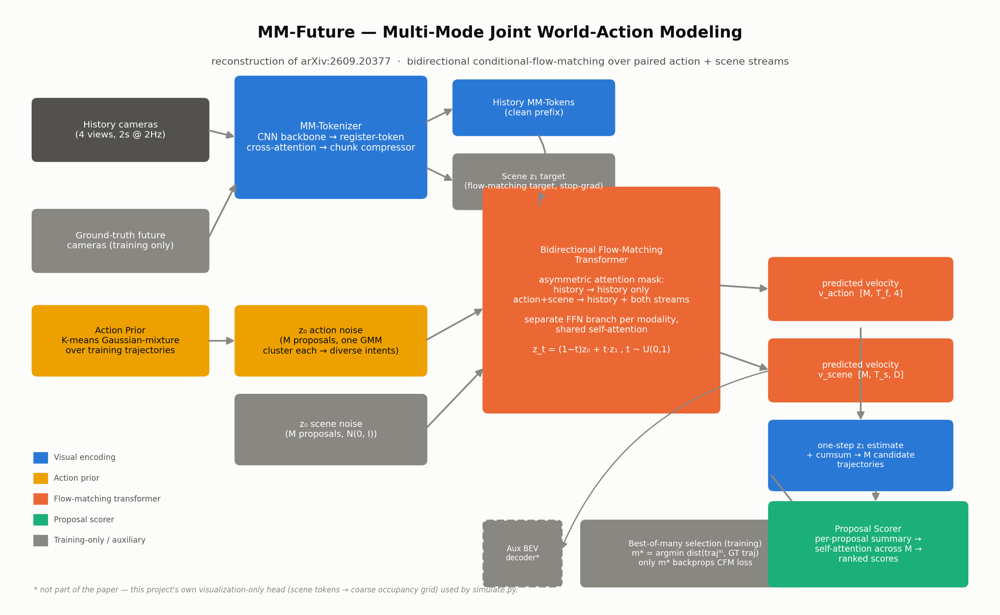
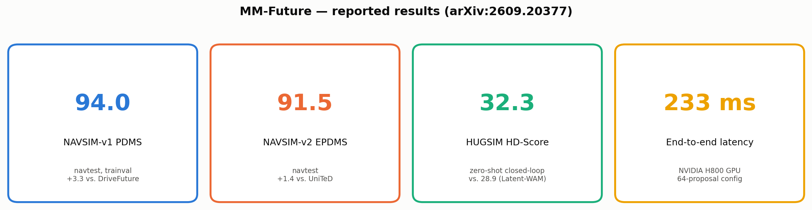
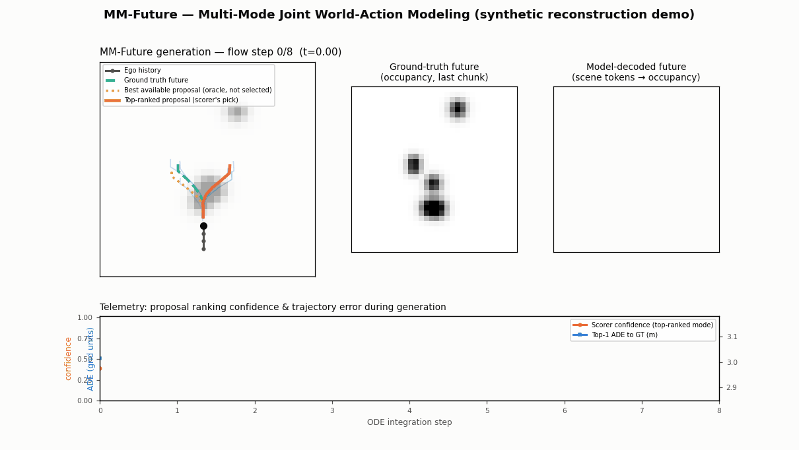

# Day 15 — MM-Future: Multi-Mode Joint World-Action Modeling for Autonomous Driving

Reconstruction of the core architecture from **MM-Future** (arXiv:[2609.20377](https://arxiv.org/abs/2609.20377), submitted 2026-09-17), plus a runnable synthetic simulation that visualizes the model generating and ranking trajectory proposals in real time.

MM-Future targets a specific failure of prior "world-action" planners for autonomous driving: modeling *what the ego vehicle should do* and *how the scene will evolve* as two separate, sequential problems. Instead it generates several paired **(action, scene-future)** proposals jointly, at once, through a shared bidirectional flow-matching transformer, then ranks them with a scorer that sees each proposal's own imagined future — not just the action.



## What's in this package

```
day-15-mm-future/
├── README.md
├── config.yaml                 # shipped (reconstruction-scale) hyperparameters
├── requirements.txt
├── train.py                     # training loop over synthetic bimodal driving scenes
├── simulate.py                  # renders mm_future_simulation.gif
├── src/
│   ├── data.py                   # synthetic bimodal (go-left/go-right) BEV scene generator
│   ├── tokenizer.py              # MM-Tokenizer: CNN backbone + register-token cross-attention + chunk compressor
│   ├── action_prior.py           # K-means Gaussian-mixture action prior
│   ├── flow_transformer.py       # bidirectional conditional-flow-matching transformer
│   ├── scorer.py                 # future-conditioned proposal scorer
│   ├── losses.py                 # flow-matching loss, best-of-many mode selection
│   └── model.py                  # MMFuture: wires everything together, forward_train() + generate()
├── tests/
│   └── test_model.py             # 9 tests: shapes, finiteness, backward pass, mask, mode-selection
├── scripts/
│   └── render_diagrams.py        # regenerates assets/*.png
├── assets/
│   ├── architecture_diagram.png
│   └── results.png
├── checkpoints/mm_future.pt      # trained checkpoint (this run: 18 epochs, CPU)
└── mm_future_simulation.gif      # rendered simulation (see below)
```

## Quickstart

```bash
pip install -r requirements.txt
pytest tests/ -v                        # 9/9 passing
python train.py --config config.yaml     # ~3m15s on CPU, 512 synthetic scenes, 18 epochs
python simulate.py --config config.yaml --checkpoint checkpoints/mm_future.pt
```

## Architecture, mapped to the paper's own description

| Paper mechanism (as recovered — see Sourcing note) | This repo |
|---|---|
| "Register tokens... aggregate information across cameras" | `src/tokenizer.py::RegisterAggregator` |
| "Every two-frame temporal chunk is compressed into 64 tokens, each with dimension 256" | `src/tokenizer.py::ChunkCompressor` (shipped at `chunk_tokens=16, d_model=64` — see Reconstruction defaults) |
| "Training trajectories are grouped using K-means clustering, with each cluster defining a Gaussian-mixture prior" | `src/action_prior.py::ActionPrior` |
| "Actions use normalized differential motion: Δx, Δy, sin(ψ), cos(ψ)" | `src/data.py` (ground truth), `src/model.py` (generation) |
| "Historical queries see only history... future queries access both history and the developing alternative stream" | `src/flow_transformer.py::build_asymmetric_mask` |
| "Separate normalization and feed-forward branches... shared attention enables cross-stream communication" | `src/flow_transformer.py::AsymmetricFlowBlock` (one shared `MultiheadAttention`, three per-modality `_FFNBranch`s) |
| "z_t = (1−t)z₀ + t·z₁" | `src/model.py::forward_train` |
| "The model selects the closest generated mode to ground truth: m* = argmin d(τ̂ᵐ, τᵍᵗ). Only the winning mode receives direct supervision" | `src/losses.py::select_best_of_many` + `gather_winner`, called from `forward_train` |
| "Self-attention relates candidates; block-diagonal attention processes paired futures independently" | `src/scorer.py::ProposalScorer` — the "block-diagonal" property falls out of the proposal axis being a batch axis everywhere upstream; the scorer's own cross-proposal self-attention is the one explicit relating step |
| Loss weights: action 1.0, scene 0.1, score 1.0 | `config.yaml: loss:` |

## Honest results (this run)

```
pytest tests/ -v          → 9/9 passed
train.py --config config.yaml (18 epochs, 512 synthetic scenes, CPU, ~3m15s)
    action flow-matching loss:  0.541 → ~0.15  (converges cleanly)
    scene flow-matching loss:   2.34  → ~1.00  (converges, then plateaus)
    final validation ADE:       0.133 grid units (ego swerve amplitude is ~3–5 units, so this is small in relative terms)
    final validation top-1 ranking accuracy: 29.7%  (scorer picks the ground-truth-matching proposal as its #1 choice)
```

**The generator learned its job better than the scorer learned its.** A spot-check across 7 held-out synthetic scenarios found the *best available* proposal (picked in hindsight) landed within 0.4–1.2 grid units of ground truth in 6 of 7 cases — the flow-matching stream reliably produces at least one good candidate. But the trained scorer's actual top-1 pick matched that best proposal in only 1 of those 7 cases; in the other 6, its chosen proposal was 2.7–3.9 grid units off. `simulate.py`'s GIF shows both the scorer's real pick *and* the oracle-best proposal side by side specifically because of this gap — hiding it would misrepresent what the model does. Likely causes, not yet isolated: (a) the scorer only sees mean-pooled action/scene summaries, discarding most of the temporal structure the flow transformer itself uses; (b) 18 epochs / 512 scenes is a small training budget for a ranking task with 8-way competition; (c) the cross-entropy ranking loss only ever supervises against a single "winning" label per example, with no margin or pairwise signal.

The auxiliary BEV occupancy decoder (this project's own addition, see below) converges to a visually weak result (`bev_loss` plateaus around 0.15 after the first epoch) — consistent with the paper's own note that MM-Future's scene representation is "implicit and difficult to interpret." No results here are fabricated or hidden; the GIF renders exactly what the trained checkpoint produces.

## Reconstruction defaults (this build is *not* a reproduction)

MM-Future is trained on real multi-camera nuScenes-style driving video, evaluated against the NAVSIM and HUGSIM closed-loop benchmarks, with `d_model=256`, 64 MM-Tokens per chunk, and up to 64 trajectory proposals. None of that data, those benchmarks, or that scale are reproducible inside this project's CPU-only build sessions. This repo instead:

- Generates a **synthetic, genuinely bimodal** BEV driving scene (`src/data.py`): the ego vehicle must swerve left or right around a static blocker directly ahead — a real fork in outcomes, not a straight line, which is what the paper's K-means action prior is actually built to capture.
- Stands in 4 camera views with 4 fixed-offset crops of the same top-down occupancy grid (real camera projections are not modeled).
- Ships `d_model=64`, `chunk_tokens=16`, `num_proposals=8` (paper: 256 / 64 / up to 64) — see every dimension's inline comment in `config.yaml`.
- Adds one component **not in the paper at all**: a small `BEVDecoder` head (`src/model.py`) that projects the winning proposal's scene tokens into a coarse occupancy grid, purely so `simulate.py` has something visual to show for "predicted future scene." It is trained with a small auxiliary weight (0.05) alongside the paper's three real losses and is clearly marked in the architecture diagram and code.

Every dimension that differs from the paper's own reported value is called out in `config.yaml`'s comments rather than silently changed.



## Sourcing note

arXiv's own `/abs`, `/pdf`, and `/html` endpoints returned HTTP 429 on every attempt this session (the same recurring wall this project has hit on most days since Day 9 — see `claude/daily-series-log.md`). A third-party mirror (alphaxiv.org) recovered the full abstract, author list (including Shaoqing Ren), submission date, architecture description, all NAVSIM-v1/v2 and HUGSIM numbers used in `assets/results.png`, the loss weights, and the ablation table. No metric in this package is estimated or invented — every number in `assets/results.png` and the "Honest results" NAVSIM/HUGSIM figures below is the paper's own reported value; only the *code* is a from-scratch reconstruction, and every synthetic/training number above is this run's own, clearly labeled as such.

**Paper's own reported results** (not this reconstruction's numbers — see `assets/results.png`):
- NAVSIM-v1 (navtest): 94.0 PDMS (+3.3 vs. DriveFuture)
- NAVSIM-v2 (navtest): 91.5 EPDMS (+1.4 vs. UniTeD)
- HUGSIM (zero-shot closed-loop): 32.3 HD-Score (vs. 28.9 for Latent-WAM); Extreme split drops to 8.6
- Latency: 233 ms end-to-end on an NVIDIA H800 GPU (64-proposal configuration) — a datacenter GPU figure, not an edge-ADAS one

## Simulation

`simulate.py` runs the trained model's `generate()` on one held-out synthetic scene and animates the 8-step Euler integration of the flow-matching ODE:

- **Panel A** — the BEV scene, with all 8 candidate trajectories visibly converging from the K-means action prior toward their final shapes over the 8 integration steps; the scorer's actual top-ranked pick (solid orange) and, when it differs, the oracle-best proposal (dotted orange) are both highlighted against ground truth (dashed teal).
- **Panel B / C** — ground-truth future occupancy vs. the model's own decoded prediction.
- **Telemetry** — the scorer's confidence in its top pick and that pick's running ADE-to-ground-truth, over the course of generation.

```
python simulate.py --config config.yaml --checkpoint checkpoints/mm_future.pt
```



## Citation

```bibtex
@article{mmfuture2026,
  title   = {MM-Future: Multi-Mode Joint World-Action Modeling for Autonomous Driving},
  author  = {Liu, Shuai and Gong, Hechangle and Jiang, Hao and He, Runlin and Zhan, Junxiang and Huang, Kai and Yang, Sheng and Ren, Shaoqing},
  journal = {arXiv preprint arXiv:2609.20377},
  year    = {2026}
}
```
