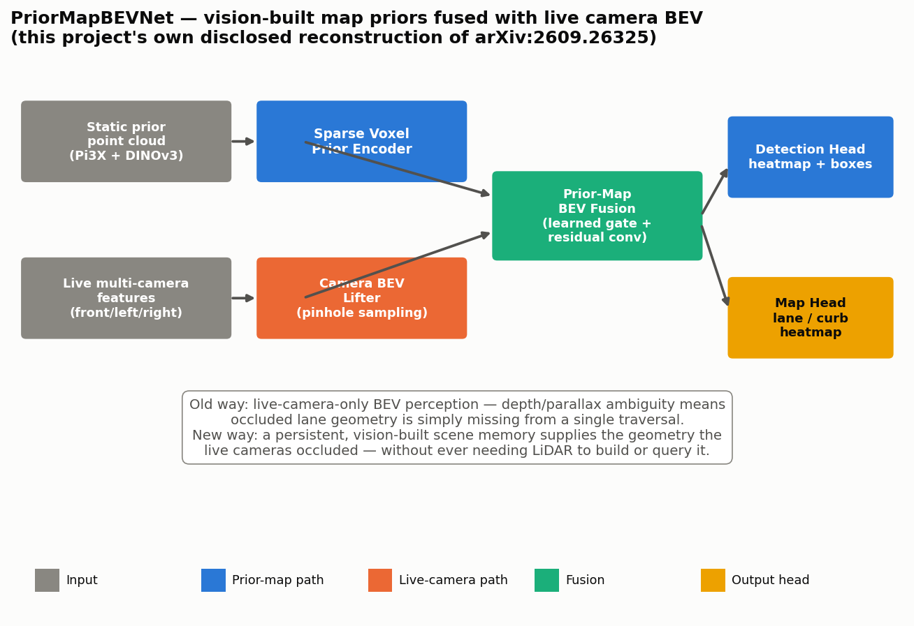
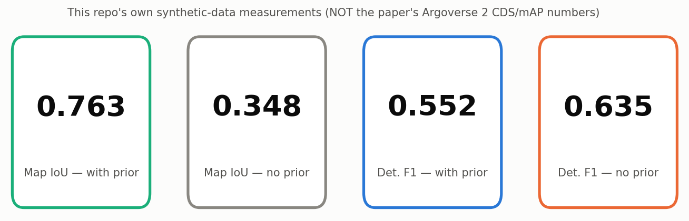

# Day 23 — PriorMapBEVNet: Vision-Built Point-Cloud Map Priors for Camera-Only 3D Detection + HD Mapping

Reconstruction of **"Leveraging Vision-Based Point Cloud Map Priors for
Camera-Based 3D Object Detection and Online Vectorized HD Mapping"**
(Käppeler, Mohan, Valada — University of Freiburg; arXiv:[2609.26325](https://arxiv.org/abs/2609.26325),
IROS 2026 Workshop on Long-Term Perception for Human-Centric Autonomy).

Only the paper's abstract was retrievable (arXiv full-text was rate-limited
— see [`SOURCING.md`](SOURCING.md)). Every architectural dimension, loss
function, and the exact fusion mechanism below is **this project's own
disclosed reconstruction**, built to test the paper's own qualitative claim
on synthetic data with known ground truth. See `SOURCING.md` for the full
paper-sourced-vs-reconstructed breakdown, and the Day 23 daily-review doc
for implementation notes and an honest discussion of where this
reconstruction's own finding diverges from the paper's.



## The idea

Camera-only autonomous-driving perception has a structural problem: a
single pass through a scene is depth-ambiguous, and whatever the cameras
happen to have occluded that one time (a truck blocking a lane line, harsh
shadow, glare) is just missing. This paper's fix doesn't reach for LiDAR —
it reaches for **memory**. Drive the same road more than once (which
production fleets do constantly) and build a persistent, camera-only point
cloud map from those repeated traversals, tagged with DINOv3 semantic
features. At inference time, localize into that map, pull the relevant
patch, and fuse it with the live camera view in BEV. The live view supplies
what changed (moving traffic); the prior map supplies what didn't (the
road geometry).

## 📁 Repository structure

```
day-23-priormapbevnet/
├── src/
│   ├── geometry.py       # BEV grid + pinhole camera-rig utilities
│   ├── dataset.py        # synthetic prior-map / live-camera scene generator
│   └── model.py          # SparseVoxelPriorEncoder, CameraBEVLifter,
│                         #   PriorMapBEVFusion, DetectionHead, MapHead
├── tests/
│   └── test_model.py     # 15 tests: geometry, shapes, gradient flow,
│                         #   overfit sanity check, core-claim regression test
├── train.py               # training loop + with-prior/without-prior evaluation
├── simulate.py             # renders priormapbevnet_simulation.gif from a real checkpoint
├── make_assets.py          # renders assets/architecture.png + assets/results.png
├── config.yaml
├── requirements.txt
├── SOURCING.md              # full paper-sourced vs. reconstructed disclosure
└── assets/
    ├── architecture.png
    └── results.png
```

## Quickstart

```bash
pip install -r requirements.txt
pytest tests/ -v
python train.py --config config.yaml
python simulate.py --config config.yaml --checkpoint checkpoint.pt
python make_assets.py
```

## Core model (PyTorch)

```python
class PriorMapBEVFusion(nn.Module):
    """Gated fusion of live and prior-map BEV features.

    A learned per-cell gate decides, cell by cell, how much to trust the
    (potentially stale, but complete) prior versus the (fresh, but
    occluded) live observation -- this repo's own reconstruction of the
    paper's "fuse ... in bird's-eye view" step.
    """

    def __init__(self, channels: int = 32):
        super().__init__()
        self.gate = nn.Sequential(
            nn.Conv2d(channels * 2, channels, 3, padding=1),
            nn.ReLU(inplace=True),
            nn.Conv2d(channels, 1, 1),
            nn.Sigmoid(),
        )
        self.fuse = nn.Sequential(
            nn.Conv2d(channels * 2, channels, 3, padding=1),
            nn.BatchNorm2d(channels),
            nn.ReLU(inplace=True),
            nn.Conv2d(channels, channels, 3, padding=1),
            nn.BatchNorm2d(channels),
        )
        self.out_relu = nn.ReLU(inplace=True)

    def forward(self, live_bev, prior_bev, prior_enabled: bool = True):
        # live_bev, prior_bev: [B, C, H, W]
        if not prior_enabled:
            prior_bev = torch.zeros_like(prior_bev)
        cat = torch.cat([live_bev, prior_bev], dim=1)      # [B, 2C, H, W]
        g = self.gate(cat)                                  # [B, 1, H, W]
        gated_prior = g * prior_bev
        fused_in = torch.cat([live_bev, gated_prior], dim=1)
        residual = self.fuse(fused_in)
        return self.out_relu(live_bev + residual)            # [B, C, H, W]
```

The full model (`src/model.py`) also includes `SparseVoxelPriorEncoder`
(scatter-mean voxel pooling of the sparse prior point cloud into a dense
BEV grid) and `CameraBEVLifter` (geometry-guided `grid_sample` lifting of
live multi-camera features into the same BEV grid via a known pinhole rig).

## Verified results (this repo's synthetic data — see `SOURCING.md`)

| Metric | With prior map | Without prior (live-only) |
|---|---|---|
| Map heatmap IoU | **0.763** | 0.348 |
| Detection F1 | 0.552 | **0.635** |

`pytest tests/ -v` → 15/15 passed. `train.py` (CPU, 16 epochs, 480 train /
80 val synthetic scenes, ~4m45s) → 77,930 parameters. The prior map more
than doubles map-reconstruction IoU under heavy live-camera occlusion —
consistent with the paper's own much-larger-mapping-than-detection
pattern — but in this reconstruction, enabling the prior makes the shared
detection head *more conservative* (precision 0.72→0.87, recall 0.58→0.41,
net F1 down), the opposite of the paper's own small positive detection
delta. Disclosed and discussed, not hidden — see `SOURCING.md` and the
Day 23 daily-review doc.



## Citation

```
@misc{kappeler2026priormap,
  title={Leveraging Vision-Based Point Cloud Map Priors for Camera-Based 3D Object Detection and Online Vectorized HD Mapping},
  author={K\"appeler, Markus and Mohan, Rohit and Valada, Abhinav},
  year={2026},
  eprint={2609.26325},
  archivePrefix={arXiv},
  primaryClass={cs.CV}
}
```
