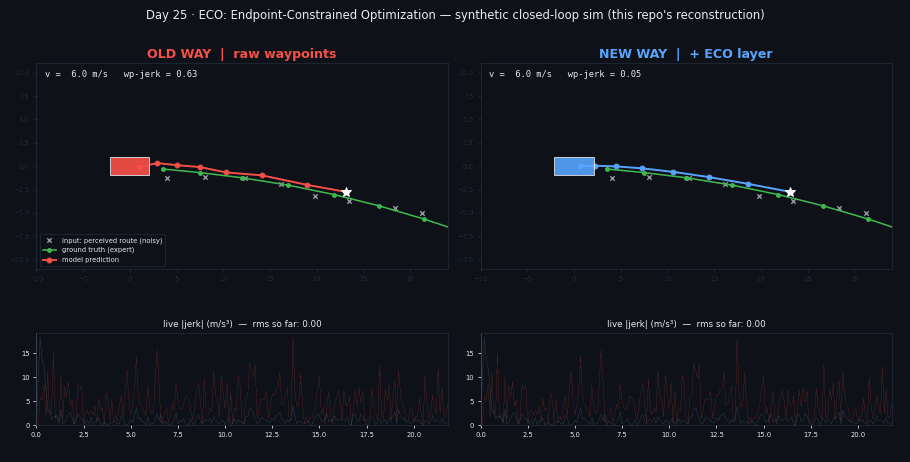

# Day 25 — ECO: Endpoint-Constrained Optimization for End-to-End Driving



Training-free layer that sits between an end-to-end driving policy and its controller. It keeps the policy's **predicted endpoint**, anchors to the **executed history**, and re-solves the **intermediate waypoints** as a smooth, trackable path. Paper: arXiv:2609.31383. **This is a disclosed reconstruction — see SOURCING.md.**

## Structure
```
eco/eco_layer.py   EndpointConstrainedOptimizer (closed-form, batched, differentiable QP)
eco/policy.py      toy waypoint-regression policy (stand-in for a BC driving policy)
eco/env.py         synthetic route + kinematic bicycle + pure-pursuit tracker + expert
eco/rollout.py     closed-loop episode, raw vs ECO
train.py  evaluate.py  simulate.py  make_assets.py  tests/  config.yaml
```
## Run
```
pip install -r requirements.txt
pytest tests -q && python train.py && python evaluate.py && python simulate.py && python make_assets.py
```
## Core layer
```python
# s = [history | ego origin | w_1..w_T];  unknowns = w_1..w_{T-1};  w_T fixed
# min  lam_a*||D2 s||^2 + lam_j*||D3 s||^2 + lam_f*||x - w_raw||^2   (closed form, A^-1 precomputed)
x = einsum(A_inv, lam_f * w_raw[:, :-1] - Qf @ fixed)      # (B, T-1, 2)
out = cat([x, w_raw[:, -1:]], 1)                            # endpoint preserved exactly
```
## Results (synthetic, 40 closed-loop episodes, same weights — not paper numbers)
| | RMS jerk | steer rate | lateral RMS | off-road |
|---|---|---|---|---|
| raw | 6.18 | 0.233 | 0.35 m | 2.5% |
| + ECO | 1.96 | 0.141 | 0.45 m | 0% |

Jerk −68%; lateral error slightly worse — the smoothing trade-off.
