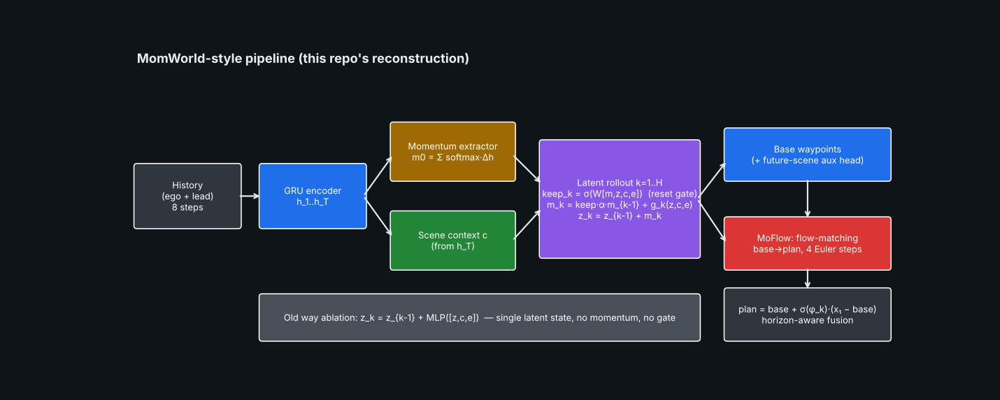
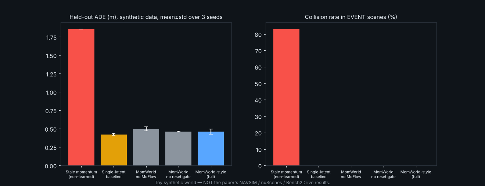

# Day 28 — MomWorld: Momentum-Aware Latent World Model (reconstruction + simulation)

Reconstruction of the ideas in **arXiv:2609.33737** (momentum-aware latent rollout, scene-adaptive reset gate, MoFlow flow-matching refiner) in PyTorch, with a fully synthetic world and a runnable "AI in action" simulation. **Read `SOURCING.md` first** — the paper's full text was not accessible; only abstract-level facts are paper-sourced, and the paper's claim did **not** reproduce on this toy world.



## Folder structure
```
day-28-momworld/
├── momworld/
│   ├── model.py      # HistoryEncoder, MomentumExtractor, MomentumWorldModel (gate), MoFlow, MomWorld
│   ├── data.py       # synthetic world: persistent momentum + abrupt lead-vehicle events
│   └── metrics.py    # ADE/FDE, collision, stale-momentum extrapolation baseline
├── tests/test_model.py   # 10 tests (shapes, gate semantics, gradient flow, overfit)
├── train.py              # trains momworld / baseline / ablations x 3 seeds -> outputs/results.json
├── simulate.py           # renders outputs/momworld_simulation.gif from the trained checkpoints
├── make_assets.py        # architecture.png + results.png
├── config.yaml  requirements.txt  SOURCING.md  LINKEDIN_POST.md
```

## Quick start
```bash
pip install -r requirements.txt
pytest tests -q            # 10 passed
python train.py            # ~10 min CPU; 12 models
python simulate.py         # -> outputs/momworld_simulation.gif
python make_assets.py
```

## Core mechanism (model.py)
```
c      = scene_ctx(h_T)
g_k    = tanh(W_g [z_{k-1}, c, e_k])                 # scene-conditioned momentum update
keep_k = sigmoid(W_r [m_{k-1}, z_{k-1}, c, e_k])     # scene-adaptive reset gate
m_k    = keep_k * alpha * m_{k-1} + g_k              # momentum persistence + update
z_k    = z_{k-1} + m_k                               # configuration advances by its momentum
plan   = base + sigmoid(phi_k) * (FlowEuler(base) - base)   # MoFlow, horizon-aware fusion
```

## Results (synthetic, 3 seeds, held-out) — see SOURCING.md for the full table and caveats
| | ADE (m) | Collision (event scenes) |
|---|---|---|
| Stale-momentum extrapolation | 1.856 | 83.0% |
| Single-latent baseline | 0.423 ± 0.013 | 0% |
| MomWorld-style | 0.462 ± 0.036 | 0% |

The paper's headline (12.2% lower collision rate vs MomAD on real benchmarks) is **not** reproduced here; the momentum model is slightly worse than the single-latent baseline in this toy.


