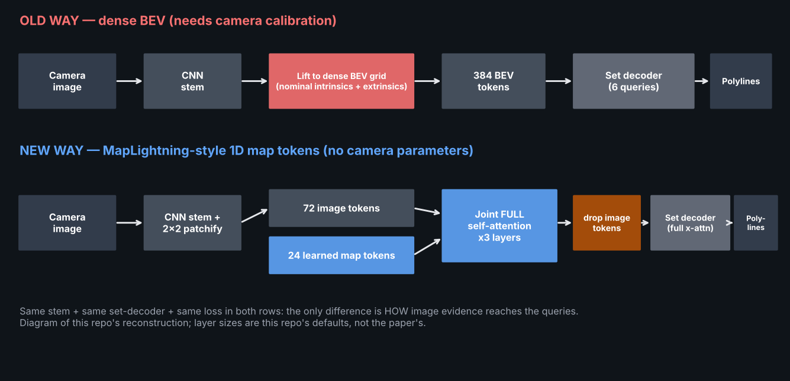
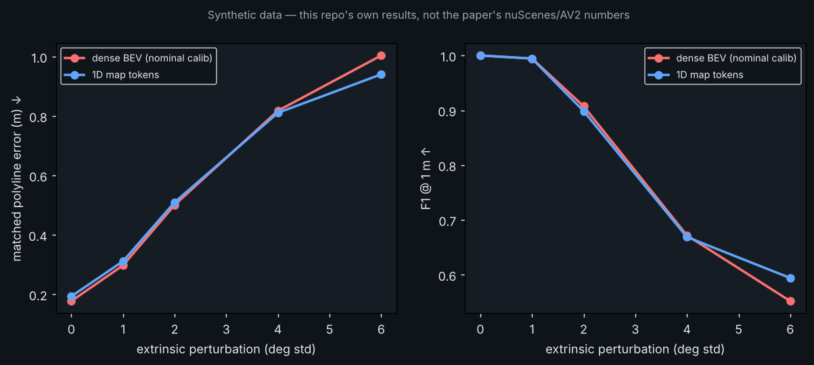

# Day 29 — MapLightning: Online Vectorized HD Map Construction with 1D Map Tokens

Reconstruction of the core idea of [arXiv:2610.01905](https://arxiv.org/abs/2610.01905) (CMU, 2026-10-01) in PyTorch, with a synthetic camera world, a dense-BEV baseline, and a real-time-style simulation overlay.
**Read `SOURCING.md` first: only abstract-level details are paper-sourced; all numbers here are from this repo's synthetic data.**



## Structure
```
day-29-maplightning/
├── config.yaml            # decimal-only floats (PyYAML safe_load)
├── requirements.txt
├── train.py               # trains both models, sweeps extrinsic jitter -> outputs/results.json
├── simulate.py            # GIF: camera input vs GT vs old-way vs new-way + live telemetry
├── make_assets.py         # architecture.png / results.png
├── src/maplightning/
│   ├── data.py            # synthetic roads, pinhole camera, renderer, jitter
│   ├── model.py           # MapLightning (1D map tokens), BEVBaseline, PolylineDecoder
│   ├── loss.py            # Hungarian matching + DETR-style set loss
│   └── metrics.py         # matched polyline error, F1@1m
├── tests/test_all.py      # 10 tests
└── assets/ outputs/
```

## Run
```bash
pip install -r requirements.txt
pytest tests -q            # 10 passed
python train.py            # ~15 min on 1 CPU
python simulate.py         # writes assets/maplightning_simulation.gif
python make_assets.py
```

## Core layer (excerpt of `model.py`)
```python
def map_tokens_out(self, img):
    t = self.patch(self.stem(img)).flatten(2).transpose(1, 2) + self.pos   # (B,72,d) image tokens
    z = torch.cat([self.map_tokens.expand(t.shape[0], -1, -1), t], 1)      # (B,24+72,d)
    z = self.enc(z)                                                        # joint FULL self-attention
    return z[:, :self.n_map]                                               # discard image tokens -> (B,24,d)
```
`forward(img)` takes **no camera parameters**; `BEVBaseline.forward(img, cam)` lifts features through a calibration.

## Results (synthetic; see SOURCING.md)

Honest summary: the two models are statistically tied up to 4° of extrinsic jitter; the 1D-token model is modestly better at 6°. The paper's robustness claim is not clearly reproduced at this scale.
