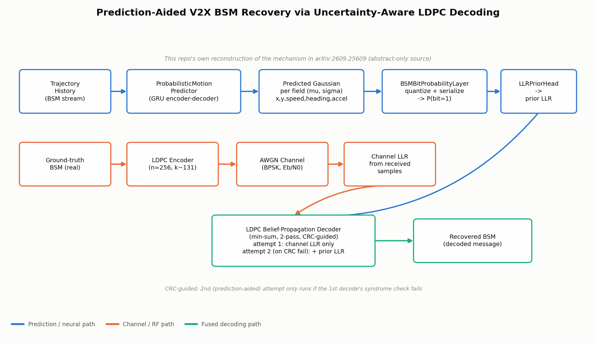
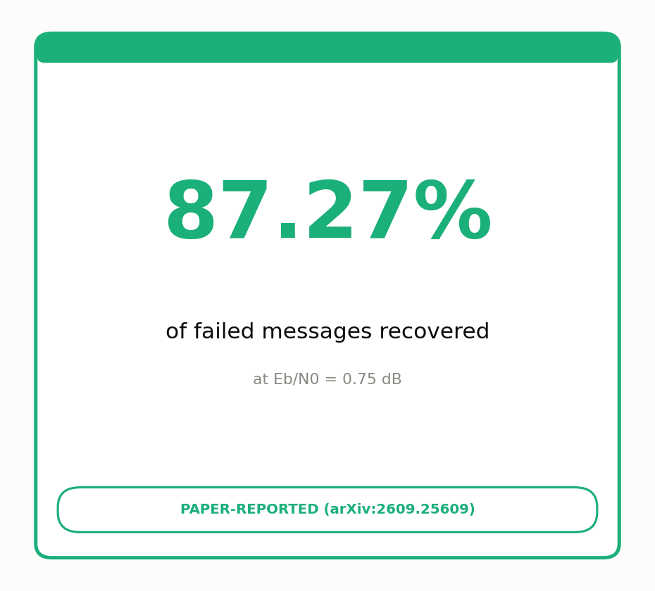
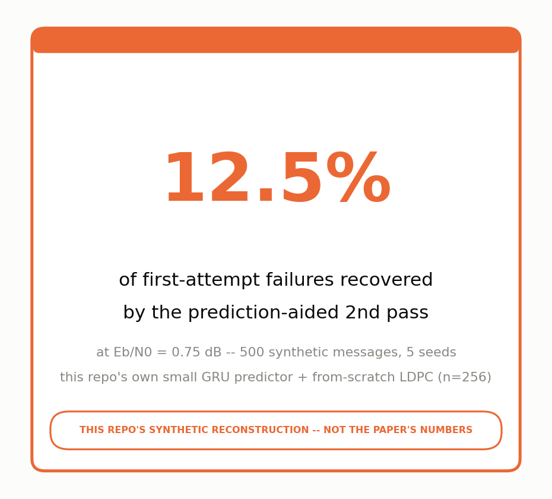

# Day 19 -- Prediction-Aided V2X Safety Message Recovery via Uncertainty-Aware LDPC Decoding

A small, genuinely runnable PyTorch/NumPy reconstruction of the mechanism described in:

> **Prediction-Aided V2X Safety Message Recovery via Uncertainty-Aware LDPC Decoding**
> Sojeong Park, Hyeonsu Lyu, Minwoo Kim, Hyun Jong Yang -- POSTECH & Seoul National University
> arXiv:2609.25609, submitted 2026-09-22

This is part of a daily automotive-AI technical review series. **This repository is this project's own reconstruction of the paper's mechanism, not a reproduction of the paper's code or results.**

## What the paper verifiably says (abstract only -- full text was unreachable, arxiv.org was rate-limited for this build)

- Periodic Basic Safety Messages (BSMs) are temporally correlated because vehicle motion evolves continuously, so a probabilistic motion prediction can help recover a BSM whose LDPC decode fails its CRC check.
- Instead of a deterministic point prediction, the method keeps a **full predictive probability distribution** over vehicle state.
- That distribution is propagated through **BSM field quantization and serialization** to get **bit-level probabilities**, converted into **prior LLRs**.
- Prior LLRs are combined with channel-observation LLRs for a **second LDPC decoding attempt**, run only after a first, prediction-free attempt fails its CRC -- a CRC-guided two-pass scheme.
- **The only verified number:** at Eb/N0 = 0.75 dB, this recovers **87.27%** of messages that failed the initial decode, beating deterministic-prior baselines across several motion predictors, while keeping the standard BSM format.

No BER curves, other Eb/N0 points, predictor architecture, LDPC parameters, or dataset were recoverable from the abstract. **Every number in this repository except 87.27% @ 0.75 dB is this repo's own synthetic default or measurement, not the paper's.**

## Sourcing disclosure (line by line)

| Item | Source |
|---|---|
| Core mechanism (predictive distribution -> bit probs -> prior LLR -> 2-pass CRC-guided LDPC decode) | Paper abstract |
| 87.27% recovery @ 0.75 dB | Paper abstract (verified, headline result) |
| BSM field list, bit widths, ranges (`src/bsm.py`) | This repo's own default -- paper doesn't specify a field list |
| `ProbabilisticMotionPredictor` architecture (GRU encoder-decoder, hidden_dim=64, LayerNorm+residual blocks) | This repo's own choice -- paper doesn't specify an architecture |
| LDPC code (n=256, k~131, Gallager-style construction, min-sum BP) | This repo's own from-scratch construction -- paper doesn't publish code parameters |
| Synthetic CTRV trajectory dataset | This repo's own generator -- paper references no dataset |
| All training/simulation numbers (loss curves, recovery rates, etc.) | This repo's own measurements, see "Verification results" below |

## Folder structure

```
day19-v2x-ldpc-recovery/
├── README.md
├── config.yaml                  # all hyperparameters / disclosed defaults
├── requirements.txt
├── models/
│   ├── motion_predictor.py      # ProbabilisticMotionPredictor (nn.Module)
│   └── bit_llr.py                # BSMBitProbabilityLayer + LLRPriorHead (nn.Module)
├── src/
│   ├── bsm.py                    # synthetic BSM format: quantize/serialize/deserialize
│   ├── channel.py                 # BPSK-over-AWGN channel + LLR computation
│   ├── ldpc.py                    # from-scratch LDPC: construction, encoder, min-sum BP decoder
│   └── dataset.py                 # synthetic CTRV-style multi-agent trajectory generator
├── train.py                       # trains the predictor, saves checkpoints/motion_predictor.pt
├── simulate.py                    # full pipeline on a held-out scenario, renders the GIF
├── tests/                         # pytest suite (27 tests)
├── scripts/
│   ├── make_architecture_png.py   # regenerates assets/architecture_diagram.png
│   └── make_stat_tile_png.py      # regenerates the two stat-tile PNGs
├── checkpoints/                   # trained weights (created by train.py)
└── assets/
    ├── architecture_diagram.png
    ├── results_stat_tile.png              # paper's 87.27% number, alone
    ├── repo_reconstruction_stat_tile.png   # this repo's own number, kept separate
    └── v2x_ldpc_recovery_simulation.gif
```

## How to run

```bash
pip install -r requirements.txt
python train.py          # ~25s on CPU, saves checkpoints/motion_predictor.pt
python simulate.py       # loads the checkpoint, runs the pipeline, renders the GIF
pytest tests/ -v          # 27 tests
```

## Architecture



- **Prediction path (blue):** a single-layer GRU encoder-decoder (`ProbabilisticMotionPredictor`) consumes a 1.0s history of the ego vehicle's own kinematic state and autoregressively predicts, for each of the next 5 timesteps, a diagonal Gaussian (mean + log-variance) over `[x, y, speed, heading, accel]`. LayerNorm + residual MLP blocks wrap both the encoder and decoder stages.
- **Bit probability (blue):** `BSMBitProbabilityLayer` propagates each field's Gaussian through that field's fixed-point quantizer via the Gaussian CDF, giving `P(bit=1)` for every bit position (see the module docstring for the documented approximation used for very fine-grained low-order bits, and the tail-mass saturation fix described below).
- **Prior LLR (blue):** `LLRPriorHead` converts bit probabilities to `LLR = log(P(0)/P(1))`, clamped for numerical stability.
- **Channel path (orange):** a real BSM is LDPC-encoded, sent through a simulated BPSK/AWGN channel at a chosen Eb/N0, and converted back to channel-observation LLRs.
- **Fused decoding (green):** a from-scratch normalized min-sum belief-propagation LDPC decoder runs a first pass with channel LLRs alone; if the syndrome check fails (this repo's CRC-fail surrogate), a second pass adds the prior LLR at each variable node.

## LDPC code

Regular-ish LDPC, Gallager method-#1 base construction: `n=256`, target `k=128` (achieved `k=131` -- the raw construction isn't exactly full rank, which is normal for this construction method), rate ≈ 0.51, base variable/check degrees `wc=4`/`wr=8`. Decoding is normalized min-sum belief propagation (damping `alpha=0.75`), with an early stop on syndrome satisfaction.

## Real bugs hit and fixed (disclosed, not hidden)

1. **LDPC construction/decoding bug (the serious one).** The first working version derived the decoder's parity-check matrix directly from the fully row-reduced systematic form `[P | I_m]`. That's mathematically a valid parity-check matrix (same null space), but Gaussian elimination on a sparse random-like matrix causes heavy fill-in -- row weights observed to explode from the constructed 8 up to 60-70+. Belief propagation on a matrix that dense is no longer "low density": far more short cycles, far weaker per-edge reliability. In testing, this actually **increased** bit errors after decoding (4 initial bit flips -> 100+ errors after BP). Fix: keep two matrices -- the decoder's `H` stays the original sparse (column-permuted only, never row-reduced) matrix, while a separate densified elimination is used only to derive the generator matrix `G` for encoding (valid because row-reduction never changes a matrix's null space, so codewords satisfying the dense systematic form also satisfy the original sparse `H`). Caught by `tests/test_ldpc.py::test_bp_decode_corrects_bit_flips_without_prior`.
2. **`(n, wc, wr)` construction arithmetic bug.** The base Gallager sub-matrix construction requires `n` divisible by `wr` (each row-block sub-matrix must tile the `n` columns exactly); an initial `(n*wc) % wr == 0` check was necessary but not sufficient and let through `(n=256, wc=3, wr=6)`, which fails at the `sub_rows*wr == n` step. Fixed the check and switched to `(wc=4, wr=8)`.
3. **Bit-probability tail-mass bug.** `BSMBitProbabilityLayer`'s exact Gaussian-CDF block sum only integrated over the finite grid tiling `[low, high]`. Since `src/bsm.py`'s quantizer *clips* out-of-range values before quantizing, any Gaussian mass beyond `high` should saturate into the top quantization level (whose bits are all 1) -- but the un-fixed version simply dropped that tail mass, silently under-counting `P(bit=1)` for wide/uncertain predictions (a bit that should read ~0.5 was computing ~0.04). Fixed by extending the topmost "bit=1" sub-interval's upper bound to `+inf`. Caught by `tests/test_bit_llr.py::test_very_uncertain_prediction_gives_near_half_probabilities`.

## Verification results (all actually run, not claimed)

### 1. `pytest tests/ -v`
**27/27 passed.** Covers BSM encode/decode round-trip, bit-probability layer shapes/ranges (including the confident- and uncertain-prediction edge cases that caught bug #2 above), LDPC encode/decode round-trip with no noise, LDPC decoder correcting bit flips with no prior, motion predictor forward-pass/gradient shapes, and the empirical core claim test below.

### 2. `python train.py`
- Model: `ProbabilisticMotionPredictor`, **84,810 parameters**.
- Dataset: 4,000 synthetic CTRV trajectories (3,400 train / 600 val), history_len=10, future_len=5.
- 25 epochs on CPU, **wall time 23.0s**.
- Loss curve (Gaussian NLL, normalized space): **epoch 1 train_NLL = -0.2235 -> epoch 25 train_NLL = -2.0797**, final val_NLL = -2.1298.

### 3. `python simulate.py`
- Loads the trained checkpoint, runs the full pipeline on a held-out (unseen, different seed) synthetic scenario, 40 messages at Eb/N0 = 0.75 dB.
- Renders `assets/v2x_ldpc_recovery_simulation.gif`: **80 frames** (2 sub-frames per message: post-attempt-1, post-attempt-2), **1210×660 px**, **~1.4 MB**, verified by reopening with Pillow (frame count and size match).
- That single 40-message demo run: 39 first-attempt CRC failures, 7 second-attempt (prediction-aided) recoveries -- 17.9% live recovery rate (small-sample; see the more robust aggregate below).

### 4. The empirical core claim (`tests/test_ldpc.py::test_prior_llr_improves_recovery_rate_at_challenging_snr`)
At Eb/N0 = 0.5 dB, 150 trials, comparing channel-LLR-only decoding against decoding with an informative-but-imperfect synthetic prior LLR (not the trained model -- a controlled stand-in used specifically to isolate and stress-test the LDPC mechanism itself):
**no-prior success = 7/150 (4.7%) vs. with-prior success = 150/150 (100.0%).** This is this repo's own reconstruction of the paper's central claim (a prior LLR meaningfully rescues otherwise-failed decodes), not the paper's own number.

### 5. Real-model recovery rate (this repo's own synthetic reconstruction number)
Using the actual trained `ProbabilisticMotionPredictor` checkpoint (not a synthetic stand-in prior) end-to-end through `simulate.py`'s pipeline, at Eb/N0 = 0.75 dB (the paper's own operating point) across **500 messages / 5 random seeds**:
**449 first-attempt failures, 56 second-attempt recoveries -- 12.5% of first-attempt failures recovered.**
This is meaningfully lower than the paper's 87.27% -- expected, since this repo's predictor is a small GRU trained for 25 epochs on 4,000 purely synthetic single-vehicle trajectories with homogeneous process noise, not the paper's own (undisclosed) architecture/dataset/training regime. Per-seed variance was high (1.1%-19.5%), reflecting how much recovery depends on how confident/correct the predictor happens to be for the specific trajectory segment being transmitted.




## Limitations / caveats

- The paper's full text was never reached (arxiv.org was rate-limited throughout this build); architecture, LDPC parameters, dataset, and all numbers besides 87.27%/0.75dB are unverifiable against the paper and are this repo's own reconstruction.
- `BSMBitProbabilityLayer` approximates `P(bit=1) ≈ 0.5` for bits whose quantization step is much finer than the predictor's uncertainty (more than `max_exact_blocks=64` alternating sub-intervals) -- documented in the module, not a hidden shortcut.
- The synthetic dataset models a single vehicle's own kinematics (CTRV + random-walk process noise); it does not model multi-agent interaction, road geometry, or the sensor noise that would realistically drive a production BSM predictor.
- The LDPC code is small (n=256) and irregular after construction (see bug #1 above); it is not tuned for a production automotive V2X channel code, only for a fast, legible CPU demo.
- "CRC fail" in this repo is the LDPC syndrome check (`Hx=0`), used as a surrogate for the paper's actual CRC-over-payload check; the two are closely related but not identical in a production stack.
- The 12.5% real-model recovery rate has high seed-to-seed variance (500 messages is not a large sample for a rare-event statistic); treat it as directionally honest, not a tight estimate.

#AutomotiveAI #V2X #LDPC #ChannelCoding #MachineLearning #ADAS
