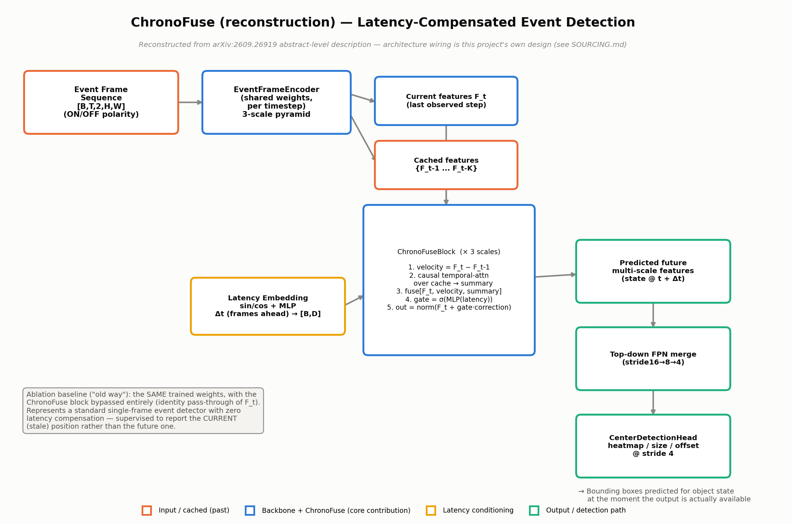
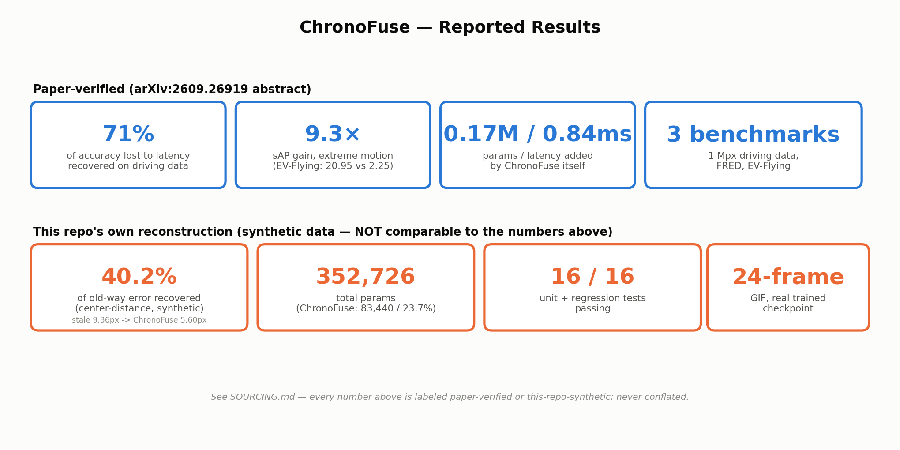

# ChronoFuse (Reconstruction) — Latency-Compensated Event-Based Object Detection

**Day 21** of the Automotive AI Daily Tech Review series.

Reconstruction of the core idea from **"Bend the Clock: Predicting Ahead to Beat
Latency in Event-Based Object Detection"** ([arXiv:2609.26919](https://arxiv.org/abs/2609.26919),
Sen, Cottereau, Cuperlier, Sim et al., submitted 2026-09-22).

> Event-camera detectors take tens of milliseconds to run. By the time a
> detection is available, the scene has already changed. **ChronoFuse**
> predicts object state for *when the output becomes available*, not for
> when the input was observed — via causal cross-time fusion over a
> multi-scale feature hierarchy, combining current representations with
> cached temporal features.

**Full sourcing disclosure — read before trusting any number in this repo:**
[`SOURCING.md`](SOURCING.md). Short version: the paper's abstract (recovered
via a third-party mirror after arXiv itself rate-limited every direct fetch
this session) names the mechanism and reports 4 headline numbers. Everything
else — the exact internal wiring, the backbone, the dataset, every number in
the "this repo's reconstruction" tile row below — is this project's own
build, disclosed as such throughout.





## 📁 Folder structure

```
day21-chronofuse/
├── README.md                    # this file
├── SOURCING.md                  # full paper-vs-reconstruction disclosure
├── requirements.txt
├── config.yaml                  # all hyperparameters (this repo's defaults)
├── train.py                     # trains + reports the old-way/ChronoFuse comparison
├── simulate.py                  # renders the GIF: input feed + GT + old-way + ChronoFuse overlay + live telemetry
├── assets/
│   ├── architecture_diagram.png
│   └── results_stat_tiles.png
├── src/
│   ├── models/
│   │   ├── backbone.py          # EventFrameEncoder — 3-scale event-frame CNN pyramid
│   │   ├── chronofuse.py        # *** the core custom layer: ChronoFuseBlock / MultiScaleChronoFuse ***
│   │   ├── detection_head.py    # FPNMerge + CenterDetectionHead (anchor-free, CenterNet-style)
│   │   └── model.py             # ChronoFuseDetector — wires backbone + cache + ChronoFuse + head
│   ├── data/
│   │   └── synthetic_events.py  # synthetic driving-scene event-frame dataset (fully disclosed as synthetic)
│   └── utils/
│       ├── latency_embed.py     # sinusoidal + MLP "frames ahead" conditioning embedding
│       ├── losses.py            # CenterNet-style target construction + focal/L1 losses
│       └── metrics.py           # heatmap peak decoding + center-distance "recovery" metric
├── tests/
│   └── test_chronofuse.py       # 16 tests — shape, gating, cache-dependence, loss/backprop, decode correctness
└── checkpoints/                 # written by train.py
```

## 🚀 Quickstart

```bash
pip install -r requirements.txt
pytest tests/ -v                                    # 16/16 passing
python train.py --config config.yaml                # ~5 min on CPU
python simulate.py --config config.yaml --checkpoint checkpoints/chronofuse.pt
```

## 📝 Core layer: `ChronoFuseBlock`

The full file is [`src/models/chronofuse.py`](src/models/chronofuse.py); the
block itself (one instance per pyramid scale, sharing one latency embedding
across scales) is reproduced here in full:

```python
class ChronoFuseBlock(nn.Module):
    """Single-scale causal cross-time fusion block.

    Args:
        channels: feature channel count C at this pyramid scale.
        latency_dim: dimensionality D of the shared latency embedding.
        cache_len: number of cached (past) feature maps this block expects.
    """

    def __init__(self, channels: int, latency_dim: int, cache_len: int = 4):
        super().__init__()
        self.channels = channels
        self.cache_len = cache_len

        # Tiny causal temporal-attention scorer: pools each cached frame's
        # feature map (global-average-pool -> [B, C]) and the current
        # frame's pooled feature, projects both to a shared key/query space,
        # and produces one attention weight per cached step. Deliberately
        # global-pooled (not per-pixel) attention to keep the parameter
        # count small, consistent with the paper's ~0.17M budget.
        self.query_proj = nn.Linear(channels, channels // 4)
        self.key_proj = nn.Linear(channels, channels // 4)

        # Fuses [current | finite-diff velocity | attended cache summary]
        # (3*C channels) back down to C channels.
        self.fuse_conv = nn.Conv2d(channels * 3, channels, kernel_size=1)

        # Latency-conditioned gate (FiLM-style): maps the shared latency
        # embedding to a per-channel gate in [0, 1] controlling how much of
        # the extrapolated correction is applied.
        self.latency_gate = nn.Sequential(
            nn.Linear(latency_dim, channels),
            nn.Sigmoid(),
        )

        self.norm = nn.GroupNorm(num_groups=min(8, channels), num_channels=channels)

    def forward(
        self,
        current: torch.Tensor,       # [B, C, H, W]  -- feature map at the last observed timestep
        cache: torch.Tensor,         # [B, K, C, H, W] -- K most recent PREVIOUS feature maps, oldest first
        latency_embed: torch.Tensor, # [B, D]  -- shared latency embedding (see LatencyEmbedding)
    ) -> torch.Tensor:
        b, c, h, w = current.shape
        k = cache.shape[1]

        # --- 1. Finite-difference "velocity" term -----------------------
        # Shape: [B, C, H, W]. Most recent cached frame == cache[:, -1].
        prev = cache[:, -1]
        velocity = current - prev

        # --- 2. Causal temporal-attention cache summary ------------------
        # Pool each cached step and the current step to [B, C], project to
        # a small key/query space, score, softmax over the K cached steps
        # (causal: only *past* steps are attended to, never the future).
        current_pooled = current.mean(dim=(-1, -2))                     # [B, C]
        cache_pooled = cache.mean(dim=(-1, -2))                         # [B, K, C]

        query = self.query_proj(current_pooled).unsqueeze(1)            # [B, 1, C/4]
        keys = self.key_proj(cache_pooled)                              # [B, K, C/4]
        scores = torch.einsum("bqd,bkd->bqk", query, keys) / (keys.shape[-1] ** 0.5)
        attn_weights = F.softmax(scores, dim=-1)                        # [B, 1, K]

        # Weighted sum of the *full* cached feature maps (not just the
        # pooled summaries) using the attention weights.
        # [B, K, C, H, W] * [B, K, 1, 1, 1] -> sum over K -> [B, C, H, W]
        weights = attn_weights.squeeze(1).view(b, k, 1, 1, 1)
        cache_summary = (cache * weights).sum(dim=1)

        # --- 3. Fuse current + velocity + cache summary ------------------
        combined = torch.cat([current, velocity, cache_summary], dim=1)  # [B, 3C, H, W]
        correction = self.fuse_conv(combined)                            # [B, C, H, W]

        # --- 4. Latency-conditioned gated residual ------------------------
        gate = self.latency_gate(latency_embed).view(b, c, 1, 1)         # [B, C, 1, 1]
        fused = current + gate * correction
        return self.norm(fused)
```

The **old-way ablation baseline** used throughout `train.py`/`simulate.py`
is not a second model — it's the exact same trained weights with the
ChronoFuse call skipped (`ChronoFuseDetector.forward(..., enable_chronofuse=False)`),
falling back to raw last-observed-frame features. This lets `simulate.py`
show a true apples-to-apples "same detector, compensation on vs. off"
comparison from a single checkpoint.

## 🐛 One real bug worth knowing about

Training initially converged (loss went down) while learning **nothing** —
held-out accuracy was worse than a random guess. Root cause: `focal_loss`
identified "positive" heatmap pixels via exact equality to `1.0`, but
gaussian-splatted targets at continuous (non-integer-pixel) object centers
almost never hit exactly `1.0` at any discrete pixel — so the positive mask
matched ~0 pixels almost every step, and the heatmap loss silently
collapsed to ~0 while predictions stayed near-zero everywhere. Caught by a
dedicated overfit-a-tiny-fixed-batch sanity check (not by watching the loss
curve, which looked fine). Full root-cause writeup and the fix: [`SOURCING.md`](SOURCING.md#implementation-notes--one-real-bug-caught-and-fixed).

## ⚠️ Honest limitations of this reconstruction

- Every number is measured on a small, fully-synthetic dataset on CPU —
  not the paper's real 1 Mpx / FRED / EV-Flying benchmarks. This repo's own
  40.2% error-recovery figure is **not comparable** to the paper's reported
  71% / 9.3× — see `SOURCING.md`.
- The causal temporal-attention cache summary here pools each frame
  globally (per-channel, not per-pixel) to keep the parameter count small;
  the paper's real fusion mechanism (not recoverable from the abstract) may
  operate at finer spatial granularity.
- The "old way" baseline is trained to detect the *current* observed
  position, which is the fairest reconstruction of "a standard detector
  with no compensation" available without a second real dataset/paper to
  calibrate against — but it is this repo's own framing choice, not
  something the paper specifies.
